# Tizen Accessibility Architecture Overview

Platform-agnostic accessibility framework extracted from DALi.

---

## 1. Vision

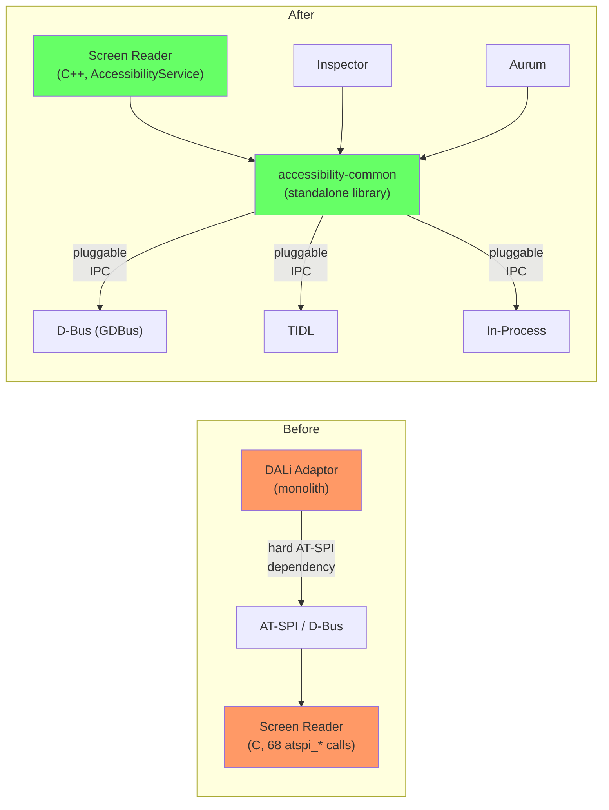

**핵심 목표**: AT-SPI/D-Bus 하드코딩 제거, IPC pluggable, Screen reader를 C++ AccessibilityService로 재작성

---

## 2. Phase Overview

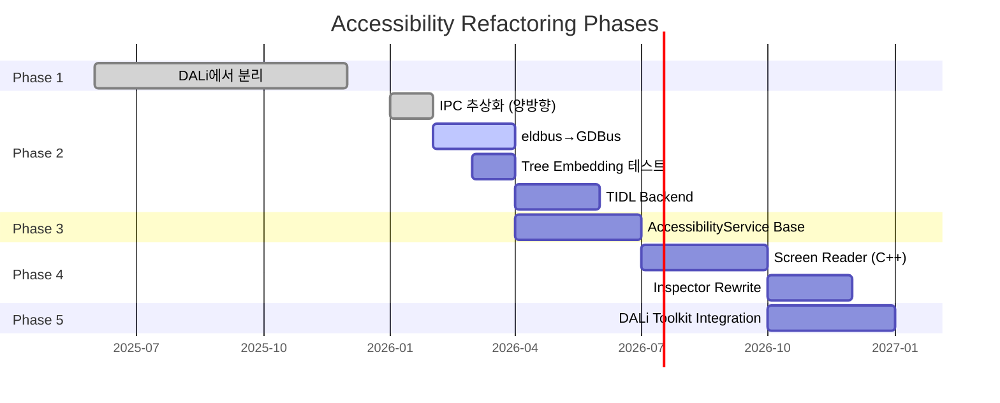

| Phase | Goal | Status |
|-------|------|--------|
| **1** | accessibility-common을 DALi에서 분리 | **DONE** |
| **2** | Bidirectional IPC 추상화 | **DONE** |
| **2.5** | eldbus → GDBus migration | **DONE** |
| **2.6** | TIDL IPC backend | **Stage A DONE** (scaffold + tidlc 코드 생성), Stage B/C는 Tizen 디바이스 필요 |
| **2.7** | Tree embedding 테스트 | **DONE** |
| **3** | AccessibilityService base class | TODO |
| **4** | Screen reader C++ rewrite | TODO |
| **5** | DALi toolkit integration | TODO |

---

## 3. End-to-End Architecture (Target State)

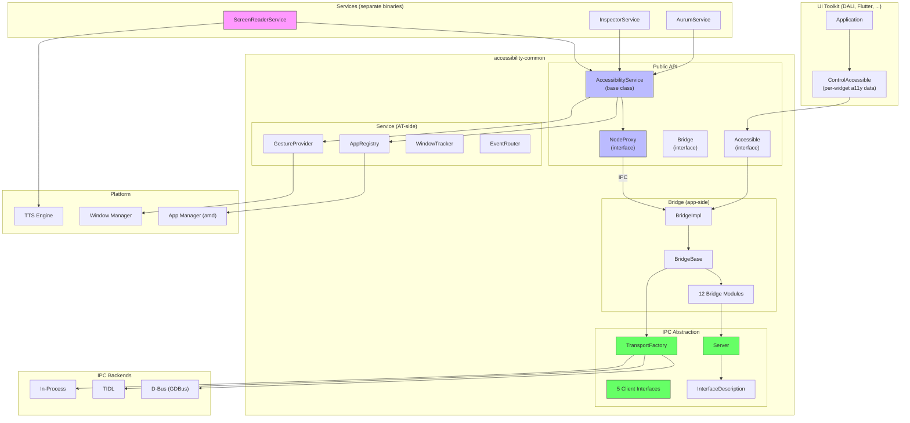

---

## 4. Phase 1: DALi에서 분리 (DONE)

### Before

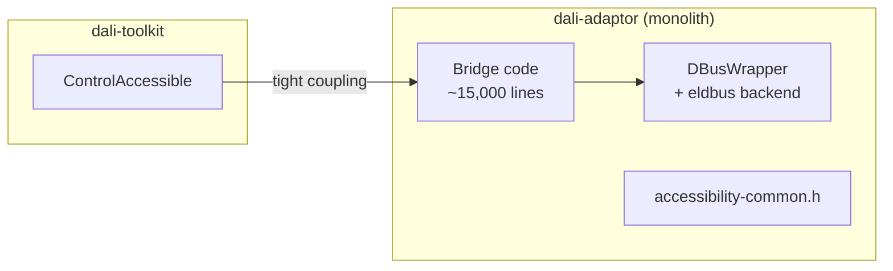

### After

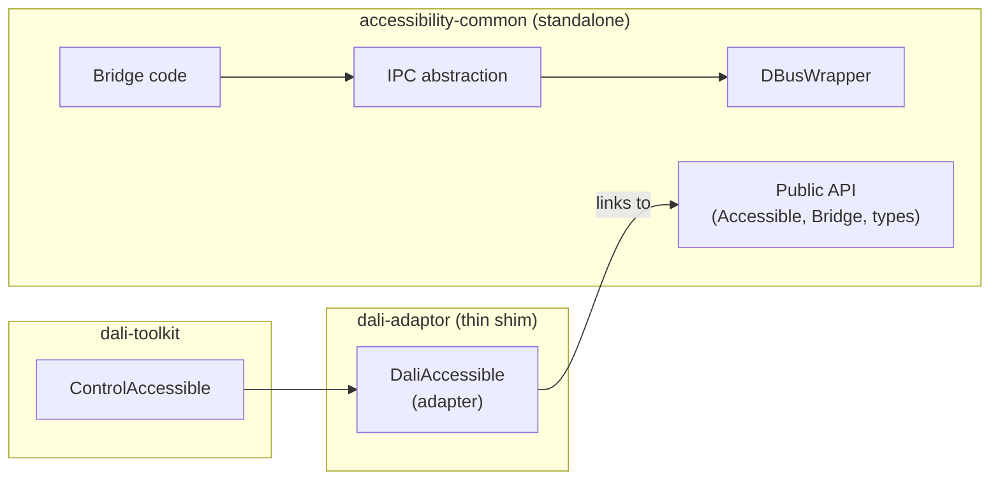

### Design Decisions

| Decision | Chosen | Rejected | Rationale |
|----------|--------|----------|-----------|
| Library boundary | Standalone `.so` | Header-only / git submodule | Independent versioning, CI, reuse by non-DALi toolkits |
| Accessible ownership | Raw `Accessible*` in bridge, `shared_ptr` for features | Shared ownership everywhere | Matches DALi's actor lifecycle; bridge doesn't own widgets |
| Platform callbacks | `PlatformCallbacks` function pointers | Virtual base class | Zero-overhead, no inheritance required, toolkit sets at init |
| Build system | CMake with conditional ATSPI/PKG | Meson / autotools | Matches DALi ecosystem |

---

## 5. Phase 2: Bidirectional IPC Abstraction (DONE)

### Problem

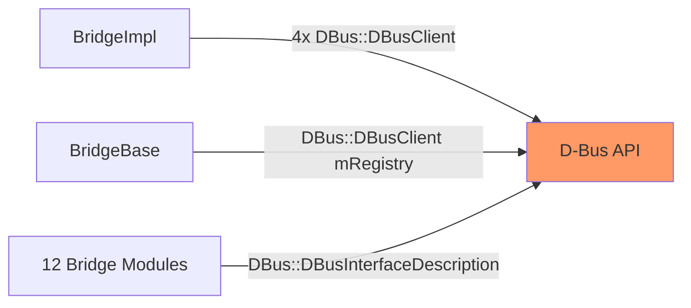

Bridge code에 D-Bus type이 직접 사용됨 → 다른 IPC backend 추가 불가

### Solution

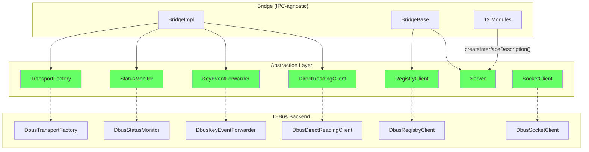

### Design Decisions

| Decision | Chosen | Rejected | Rationale |
|----------|--------|----------|-----------|
| Client abstraction | 5 domain-specific interfaces | Generic `Ipc::Client` with type-erased methods | Type safety, clear contracts, easy to mock |
| Factory pattern | Abstract Factory (`TransportFactory`) | Service Locator / DI container | Single entry point, same connection shared |
| InterfaceDescription creation | `Server::createInterfaceDescription()` | Direct construction | Bridge modules don't `#include` D-Bus headers |
| Helper template dispatch | `static_cast` to concrete type inside helpers | Full type erasure in `InterfaceDescription` | Pragmatic — avoids complex template machinery |
| Factory injection | Constructor (`BridgeImpl()`) | External via `CreateBridge()` | `mTransportFactory` is `protected` |

### Pros / Cons

| Pros | Cons |
|------|------|
| New IPC backends without bridge code changes | 12 new files |
| D-Bus types confined to `dbus/` directory | `static_cast` in helpers ties to one backend at a time |
| Each component independently mockable | InterfaceDescription registration not fully type-erased |
| Zero runtime overhead (virtual dispatch << IPC latency) | No runtime backend switching |
| Incremental migration, tests green throughout | — |

---

## 6. Phase 2.5: eldbus → GDBus (TODO)

### Problem

`dbus-tizen.cpp` uses EFL's `eldbus` → EFL dependency on all platforms

### Solution

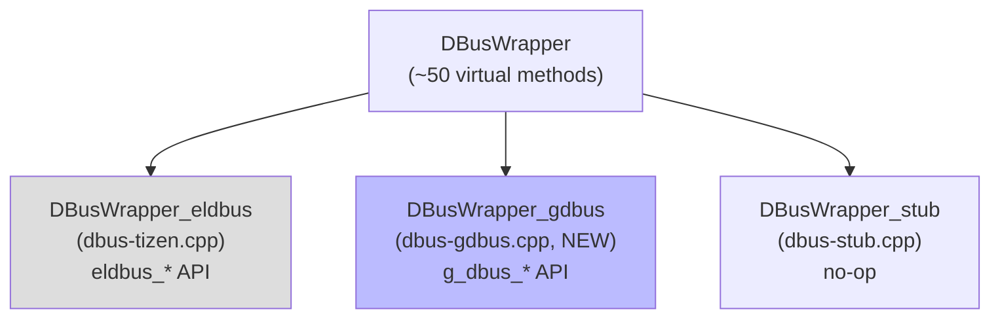

| Aspect | eldbus | GDBus |
|--------|--------|-------|
| Dependency | EFL (ecore, eldbus) | GLib (gio-2.0) |
| Platforms | Tizen only | Linux, macOS (Homebrew), Windows (MSYS2) |
| Message model | `Eldbus_Message_Iter` (sequential) | `GVariant` (tree-structured) |
| Thread safety | Single-threaded (ecore) | Thread-safe by default |
| Maintenance | Tizen-specific | Active GNOME project |

### Pros / Cons

| Pros | Cons |
|------|------|
| EFL dependency removed | ~2000 lines to reimplement |
| Works on macOS/Ubuntu/Android | GLib dependency added |
| `GVariant` is more type-safe | Different iteration model for containers |
| Active community maintenance | — |

---

## 7. Phase 2.6: TIDL Backend (Stage A DONE)

### Problem

D-Bus requires a daemon → overhead, no native Tizen security integration

### Solution

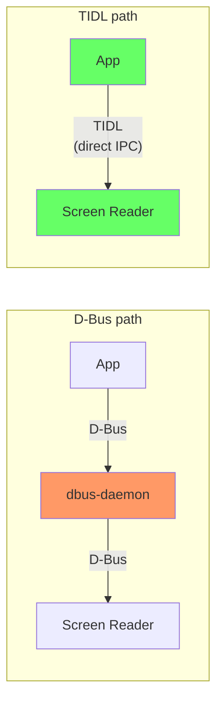

| Aspect | D-Bus | TIDL |
|--------|-------|------|
| Routing | Via dbus-daemon (central) | Direct P2P |
| Security | D-Bus policy files | Cynara (Tizen native) |
| Code generation | None (runtime registration) | `tidlc` codegen (compile-time) |
| Portability | Linux/macOS | Tizen only |
| Latency | Higher (daemon hop) | Lower (direct) |

### Implementation Status

#### Stage A: Scaffold (DONE, macOS)

- `tidl/` 디렉터리에 10개 파일 생성 (interface description, server, factory, 5 client stubs)
- `accessibility-service.tidl`: 모든 AT-SPI 메서드를 TIDL 인터페이스로 정의 (tidlc 검증 완료)
- `TidlInterfaceDescription`: `DBusInterfaceDescription`과 동일한 `addMethod<T>` / `addProperty<T>` / `addSignal<ARGS...>` 템플릿 API
- `bridge-base.h`: `#ifdef ENABLE_TIDL_BACKEND`로 concrete type cast 분기
- CMake `ENABLE_TIDL` 옵션 + `rpc-port` pkg-config 통합
- D-Bus 백엔드 56/56 테스트 통과 확인 (regression 없음)

#### Stage B/C: Tizen 디바이스 환경에서 수행해야 할 작업

macOS에서 `tidlc` 바이너리(v2.3.3)로 C++ stub/proxy 코드 생성은 가능하지만, 생성된 코드가 Tizen 플랫폼 API(`rpc_port_*`, `bundle_*`)를 ~2,000회 호출하므로 실제 IPC 테스트는 Tizen 런타임에서만 가능하다.

**macOS vs Tizen 비교:**

| | GDBus (Phase 2.5) | TIDL (Phase 2.6) |
|---|---|---|
| macOS 데몬 | `brew install dbus` → 동작 | rpc-port 데몬 없음 |
| 라이브러리 | `libgio-2.0` macOS 빌드 있음 | `librpc-port.so` Tizen 전용 |
| macOS IPC 테스트 | full round-trip 검증 완료 | 불가능 |
| 런타임 의존성 | dbus-daemon | cynara + aul + app framework 전체 |

**Tizen 디바이스 환경에서의 작업 목록:**

1. **tidlc 코드 생성 및 빌드 검증**
   ```bash
   tidlc -s -l C++ -i accessibility-service.tidl -o generated/accessibility-bridge-stub
   tidlc -p -l C++ -i accessibility-service.tidl -o generated/accessibility-bridge-proxy
   ```
   생성된 `ServiceBase` 클래스는 모든 TIDL 메서드에 대해 pure virtual 메서드를 제공.

2. **TidlIpcServer dispatch 구현**: 생성된 `ServiceBase`를 상속하여 `TidlInterfaceDescription`에 저장된 핸들러로 dispatch. `ServiceBase::GetName(objectPath)` → `mMethods["GetName"]` callback 호출.

3. **5개 Client wrapper 구현**: 생성된 proxy 클래스를 감싸서 `Ipc::StatusMonitor`, `Ipc::KeyEventForwarder` 등의 인터페이스 구현. Delegate callback → `listenXxx()` callback 연결.

4. **통합 테스트**: `ENABLE_TIDL=ON`으로 빌드 후 Tizen 스크린 리더와 연동 테스트.

### Pros / Cons

| Pros | Cons |
|------|------|
| No daemon → faster boot, less memory | Tizen only |
| Compile-time type checking (codegen) | Build complexity (tidlc) |
| Native Tizen security (Cynara) | Requires full-stack migration (both app and AT) |
| — | No AT-SPI compatibility with existing tools |
| — | macOS에서 end-to-end 테스트 불가 (GDBus와 달리) |

---

## 8. Phase 3: AccessibilityService Base Class (TODO)

### Problem

Screen reader (C), Inspector, Aurum each implement their own AT-SPI communication from scratch.

### Solution: Android-inspired AccessibilityService pattern

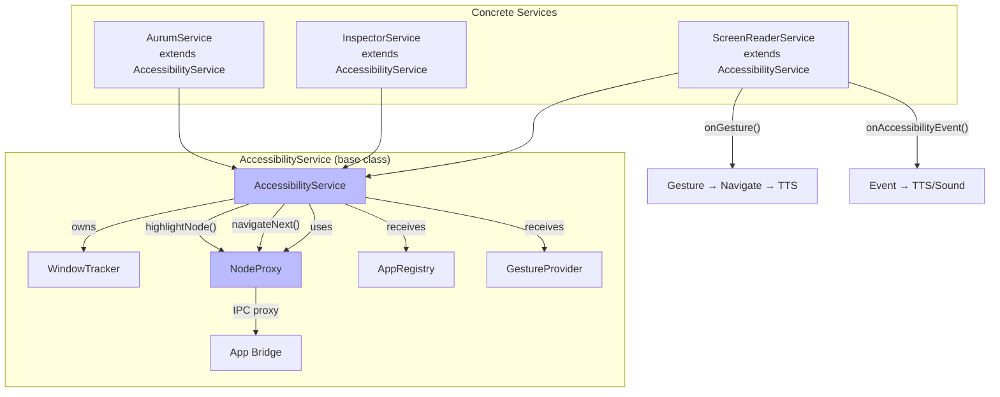

### Key Interfaces

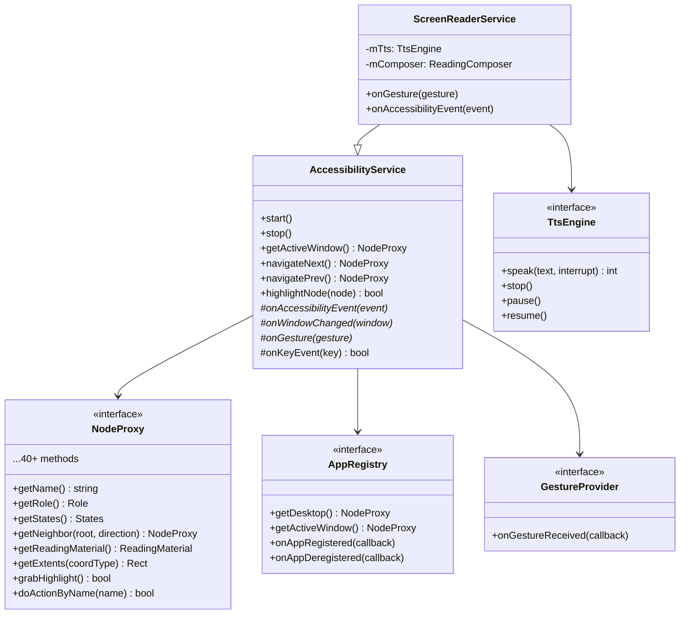

### Architecture: Proxy vs Cache

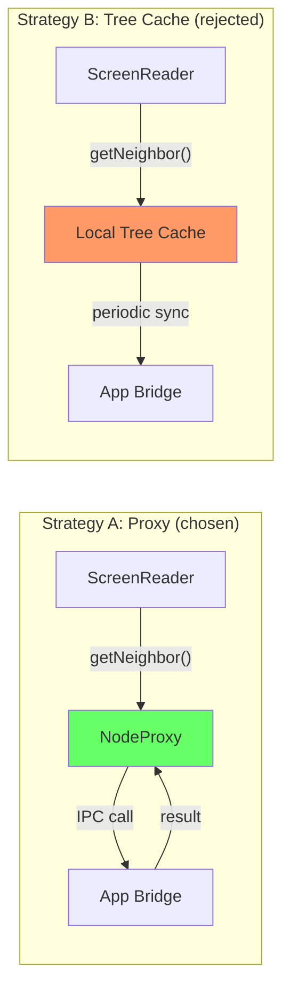

| Aspect | Proxy (A) | Cache (B) |
|--------|-----------|-----------|
| Complexity | Low | High (sync, invalidation) |
| Freshness | Always current | May be stale |
| Latency | 1 IPC per call | Near-zero after sync |
| Memory | O(1) per node | O(n) entire tree |
| Chosen? | **Yes** | No (add later if needed) |

**완화책**: `getReadingMaterial()` batch call이 name+role+states+value+parent를 한번에 fetch → round-trip 최소화

Tree embedding (WebView 등) 시나리오에서의 Proxy vs Cache 상세 비교 분석은 [tree-embedding-analysis.md](tree-embedding-analysis.md) 참조. 결론: Strategy A의 Socket/Plug protocol 복잡도는 설정 시점에 한정되지만, Strategy B의 cache sync 비용은 runtime 내내 발생하므로 Proxy가 기본값으로 적합.

### Design Decisions

| Decision | Chosen | Rejected | Rationale |
|----------|--------|----------|-----------|
| Navigation strategy | Proxy (Strategy A) | Local tree cache (B) | Simpler, always fresh, optimize later if needed |
| NodeProxy granularity | Single interface (~40 methods) | Split per AT-SPI interface | Screen reader needs all of them; splitting adds complexity |
| Base class vs composition | Base class with virtual hooks | Strategy/Observer pattern | Android pattern proven at scale; subclass = one service |
| Window tracking | Built into base class | External plugin | Every service needs it; common logic |
| IPC direction | AT queries App (pull) | App pushes to AT (push) | Matches AT-SPI model; AT controls navigation |

### Pros / Cons

| Pros | Cons |
|------|------|
| Screen reader/Inspector/Aurum share base class | NodeProxy methods are all IPC → latency |
| IPC backend swap transparent to service code | WindowTracker must be reimplemented from C |
| New AT = one subclass | AT-SPI protocol compatibility must be exact |
| Testable with mocks (MockNodeProxy, etc.) | Event loop integration varies by platform |

---

## 9. Phase 4: Service Implementations (TODO)

### 4a: Screen Reader (REQUIRED)

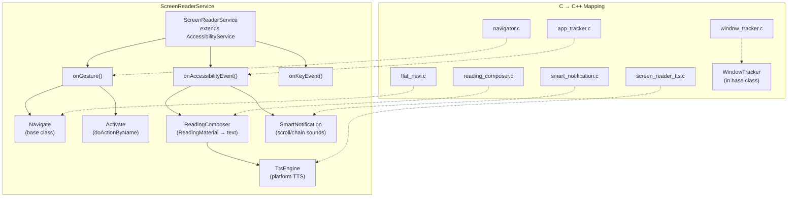

| C Source | Lines | C++ Replacement | Pure Logic? |
|----------|-------|-----------------|-------------|
| `navigator.c` | ~800 | `ScreenReaderService::onGesture()` | No (IPC) |
| `flat_navi.c` | ~400 | `AccessibilityService::navigateNext/Prev()` | No (IPC) |
| `reading_composer.c` | ~600 | `ReadingComposer` class | **Yes** |
| `smart_notification.c` | ~200 | `SmartNotification` class | **Yes** |
| `screen_reader_tts.c` | ~300 | `TtsEngine` (platform impl) | No (platform) |
| `window_tracker.c` | ~500 | `WindowTracker` (base class) | Partially |
| `keyboard_tracker.c` | ~200 | `onKeyEvent()` hook | No (platform) |
| `app_tracker.c` | ~600 | `onAccessibilityEvent()` | No (IPC) |

구현 순서: ReadingComposer → SmartNotification → TtsEngine → GestureProvider → ScreenReaderService → main

### 4b: Inspector (OPTIONAL)

기존 `DirectQueryEngine` + `WebInspectorServer` 위에 재구축. 현재 동작하므로 우선순위 낮음.

### 4c: Aurum (OPTIONAL)

기존 aurum이 AT-SPI 직접 사용. AccessibilityService API로 전환하면 screen reader와 동일 경로 → 테스트 일관성 향상.

### 4d: macOS NSAccessibility Backend (OPTIONAL)

Native macOS accessibility backend using `NSAccessibilityElement`. VoiceOver와 직접 통합.

| Component | Description |
|-----------|-------------|
| `DaliAccessibleNode` | `NSAccessibilityElement` subclass wrapping `Accessible` objects |
| VoiceOver 통합 | `accessibilityChildren`, `accessibilityHitTest`, `accessibilityFocusedUIElement` |
| Event notification | `NSAccessibilityPostNotification` for state/focus/value changes |
| Rendering surface | macOS `NSWindow` + OpenGL/Metal view 필요 |

D-Bus/AT-SPI가 아닌 macOS native accessibility protocol을 사용하므로, IPC 추상화 레이어와는 별도의 backend path.

---

## Phase 5: Toolkit Integration (Planned)

accessibility-common을 DALi의 dependency로 다시 통합. 현재 dali-adaptor 내의 accessibility 코드를 대체.

| Goal | Description |
|------|-------------|
| dali-adaptor dependency | `dali-adaptor`가 accessibility-common에 의존 (코드 포함 대신) |
| ControlAccessible | `dali-toolkit`의 `ControlAccessible`이 `Accessible` interface 구현 |
| Platform callbacks | DALi adaptor lifecycle에서 `PlatformCallbacks` 연결 |
| Zero behavior change | 기존 accessibility consumer 동작 변경 없음 |

---

## 10. Full Stack Data Flow

App → Bridge → IPC → Screen Reader 간의 signal, method call, navigation sequence diagram은 [data-flow.md](data-flow.md) 참조.

핵심 흐름:
- **Event**: App `SetName()` → Bridge `emitSignal()` → Screen Reader `onAccessibilityEvent()` → `getReadingMaterial()` → TTS
- **Navigation**: Gesture → `navigateNext()` → `getNeighbor()` IPC → `grabHighlight()` → TTS
- **Init**: `SetPlatformCallbacks()` → `GetCurrentBridge()` → `Initialize()` → `ApplicationResumed()` → `ForceUp()`

---

## 11. Repository Structure (Target)

```
accessibility-common/
├── accessibility/
│   ├── api/                          # Public API
│   │   ├── accessible.h              # Accessible interface
│   │   ├── accessibility-bridge.h    # Bridge interface
│   │   ├── component.h               # Component (extents, layer)
│   │   ├── types.h                   # Role, State, enums
│   │   ├── accessibility-service.h   # ← Phase 3: base class
│   │   ├── node-proxy.h             # ← Phase 3: AT-side node interface
│   │   ├── app-registry.h           # ← Phase 3: app discovery
│   │   └── ...
│   │
│   ├── internal/
│   │   ├── bridge/                   # App-side bridge
│   │   │   ├── ipc/                  # IPC abstraction (Phase 2)
│   │   │   │   ├── ipc-server.h
│   │   │   │   ├── ipc-transport-factory.h
│   │   │   │   ├── ipc-status-monitor.h
│   │   │   │   ├── ipc-key-event-forwarder.h
│   │   │   │   ├── ipc-direct-reading-client.h
│   │   │   │   ├── ipc-registry-client.h
│   │   │   │   └── ipc-socket-client.h
│   │   │   │
│   │   │   ├── dbus/                 # D-Bus backend
│   │   │   │   ├── dbus.h            # Core DBus abstraction
│   │   │   │   ├── dbus-tizen.cpp    # eldbus (current)
│   │   │   │   ├── dbus-gdbus.cpp   # ← Phase 2.5: GDBus
│   │   │   │   ├── dbus-stub.cpp     # stub (macOS/CI)
│   │   │   │   ├── dbus-transport-factory.h
│   │   │   │   └── dbus-*-client.h   # 5 D-Bus client impls
│   │   │   │
│   │   │   ├── tidl/                # ← Phase 2.6: TIDL backend
│   │   │   │   ├── tidl-transport-factory.h
│   │   │   │   └── tidl-*-client.h
│   │   │   │
│   │   │   ├── bridge-base.h/.cpp
│   │   │   ├── bridge-impl.cpp
│   │   │   └── bridge-*.cpp          # 12 bridge modules
│   │   │
│   │   └── service/                  # ← Phase 3: AT-side service
│   │       ├── atspi-node-proxy.cpp
│   │       ├── atspi-app-registry.cpp
│   │       ├── atspi-event-router.cpp
│   │       └── window-tracker.cpp
│   │
│   └── service/                      # ← Phase 4: service implementations
│       └── screen-reader/
│           ├── screen-reader-service.h/.cpp
│           ├── reading-composer.h/.cpp
│           └── smart-notification.h/.cpp
│
├── tools/
│   ├── inspector/                    # CLI/Web inspector (exists)
│   └── screen-reader/               # ← Phase 4: screen reader binary
│       └── main.cpp
│
├── test/                             # Tests (31 existing + growing)
├── build/tizen/                      # CMake build
└── docs/
    ├── architecture-overview.md      # This document (concise)
    ├── phase2-ipc-abstraction.md     # Phase 2 detailed design
    ├── tree-embedding-analysis.md    # Proxy vs Cache for embedding
    ├── data-flow.md                  # Sequence diagrams
    ├── inspector-architecture.md     # CLI/Web inspector details
    └── mock-and-test.md              # Mock, build system, test infra
```

---

## 12. Key Abstractions Across Phases

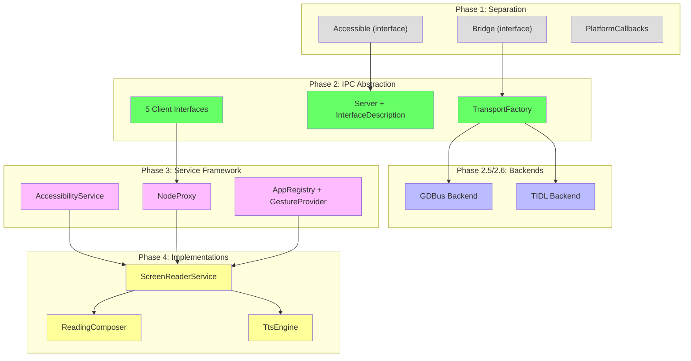

---

## 13. Decision Log (Cross-Phase)

| # | Phase | Decision | Chosen | Rationale |
|---|-------|----------|--------|-----------|
| 1 | 1 | Library structure | Standalone `.so` | Independent of DALi lifecycle |
| 2 | 1 | Accessible ownership | Raw pointers + shared_ptr features | Matches toolkit actor lifecycle |
| 3 | 1 | Platform decoupling | `PlatformCallbacks` function pointers | No base class dependency on toolkit |
| 4 | 2 | Client abstraction style | 5 domain-specific interfaces | Type safety, mockability |
| 5 | 2 | Backend creation | Abstract Factory (`TransportFactory`) | Single entry point for backend |
| 6 | 2 | Interface registration | `static_cast` in helpers | Pragmatic; avoids type erasure |
| 7 | 2.5 | D-Bus library | GDBus (GLib) over eldbus (EFL) | Broader platform support |
| 8 | 2.6 | Alternative IPC | TIDL | D-Bus daemon 제거, Tizen native IPC |
| 9 | 3 | Navigation model | Proxy (not tree cache) | Simpler, always fresh |
| 10 | 3 | Service pattern | Android AccessibilityService | Proven at scale |
| 11 | 3 | NodeProxy scope | Single interface (~40 methods) | All methods needed by screen reader |
| 12 | 3 | Registry daemon | Not needed (use existing amd) | Avoid new daemon |
| 13 | 4 | Screen reader language | C++ (not C) | Type safety, share base class |
| 14 | 4 | TTS composition | Separate `ReadingComposer` class | Pure logic, testable |

---

## 14. Risk Matrix

| Risk | Phase | Impact | Likelihood | Mitigation |
|------|-------|--------|------------|------------|
| GDBus `GVariant` mismatch with nested containers | 2.5 | High | Medium | Extensive unit tests per type |
| TIDL lacks D-Bus introspection / property signals | 2.6 | Medium | High | Implement equivalent in TIDL interface |
| NodeProxy IPC latency hurts screen reader performance | 3 | High | Low | `getReadingMaterial()` batch call |
| AtSpiNodeProxy doesn't match bridge protocol exactly | 3 | High | Medium | Test against real AT-SPI apps |
| Event loop integration differs per platform | 3-4 | Medium | Medium | `PlatformCallbacks` extension |
| C → C++ screen reader logic port introduces bugs | 4 | Medium | Medium | Port pure logic first (ReadingComposer) |

---

## 15. Verification Strategy

| Phase | Test Method | Expected |
|-------|------------|----------|
| 1 | `accessibility-test` | 31 passed |
| 2 | `accessibility-test` (unchanged) | 31 passed |
| 2.5 | + GDBus integration test on session bus | 31 + N passed |
| 2.7 | + Tree embedding unit tests | 31 + 10 passed |
| 3 | + AccessibilityService unit tests (mock providers) | 31 + N passed |
| 4a | Screen reader binary vs AT-SPI apps | End-to-end TTS |
| 5 | Full stack rebuild + existing AT-SPI consumers | Zero behavior change |
| Full stack | accessibility-common → dali-adaptor → dali-toolkit → dali-demo | GUI app with a11y |

Test coverage 상세 및 build 방법은 [mock-and-test.md](mock-and-test.md) 참조.

---

## Appendix (detailed docs)

| Topic | File |
|-------|------|
| Mock architecture, build system, test infrastructure | [mock-and-test.md](mock-and-test.md) |
| Inspector architecture (CLI, Web, REST API) | [inspector-architecture.md](inspector-architecture.md) |
| Phase 2 IPC abstraction detailed design | [phase2-ipc-abstraction.md](phase2-ipc-abstraction.md) |
| Tree embedding: Proxy vs Cache deep analysis | [tree-embedding-analysis.md](tree-embedding-analysis.md) |
| Full stack data flow (sequence diagrams) | [data-flow.md](data-flow.md) |
