# Tizen Accessibility Architecture Overview

Platform-agnostic accessibility framework extracted from DALi.

---

## 1. Vision

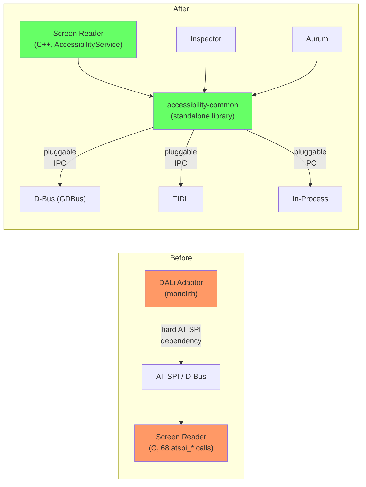

**핵심 목표**: AT-SPI/D-Bus 하드코딩 제거, IPC pluggable, Screen reader를 C++ AccessibilityService로 재작성

---

## 2. Phase Overview

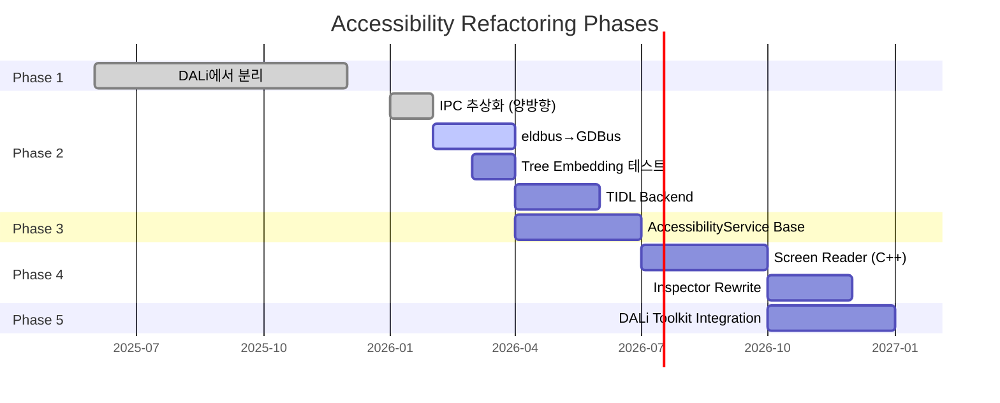

| Phase | Goal | Status |
|-------|------|--------|
| **1** | accessibility-common을 DALi에서 분리 | **DONE** |
| **2** | Bidirectional IPC 추상화 | **DONE** |
| **2.5** | eldbus → GDBus migration | TODO |
| **2.6** | TIDL IPC backend | TODO |
| **2.7** | Tree embedding 테스트 | TODO |
| **3** | AccessibilityService base class | TODO |
| **4** | Screen reader C++ rewrite | TODO |
| **5** | DALi toolkit integration | TODO |

---

## 3. End-to-End Architecture (Target State)

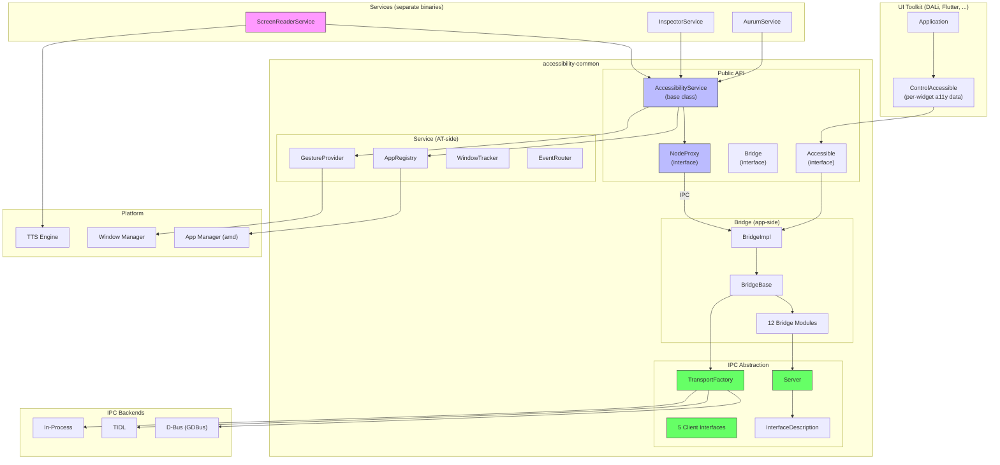

---

## 4. Phase 1: DALi에서 분리 (DONE)

### Before

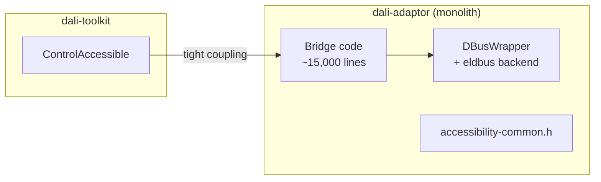

### After

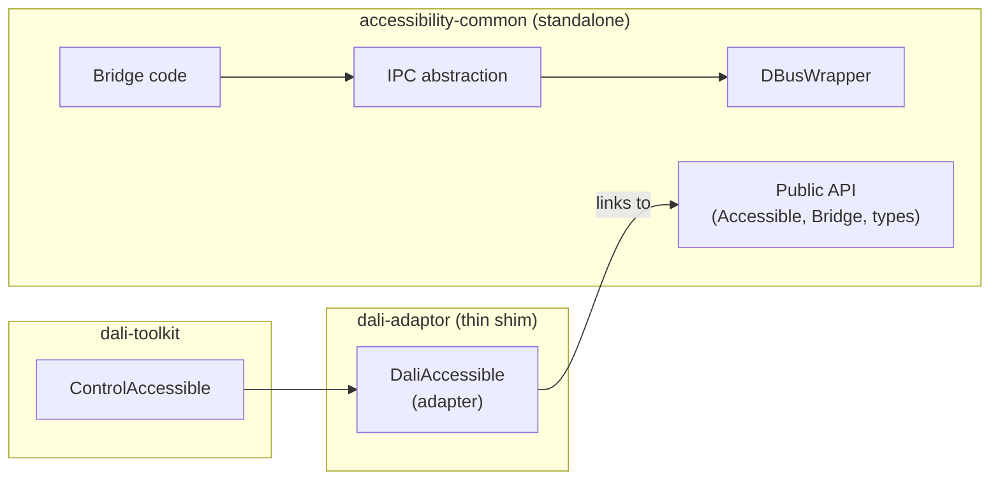

### Design Decisions

| Decision | Chosen | Rejected | Rationale |
|----------|--------|----------|-----------|
| Library boundary | Standalone `.so` | Header-only / git submodule | Independent versioning, CI, reuse by non-DALi toolkits |
| Accessible ownership | Raw `Accessible*` in bridge, `shared_ptr` for features | Shared ownership everywhere | Matches DALi's actor lifecycle; bridge doesn't own widgets |
| Platform callbacks | `PlatformCallbacks` function pointers | Virtual base class | Zero-overhead, no inheritance required, toolkit sets at init |
| Build system | CMake with conditional ATSPI/PKG | Meson / autotools | Matches DALi ecosystem |

---

## 5. Phase 2: Bidirectional IPC Abstraction (DONE)

### Problem

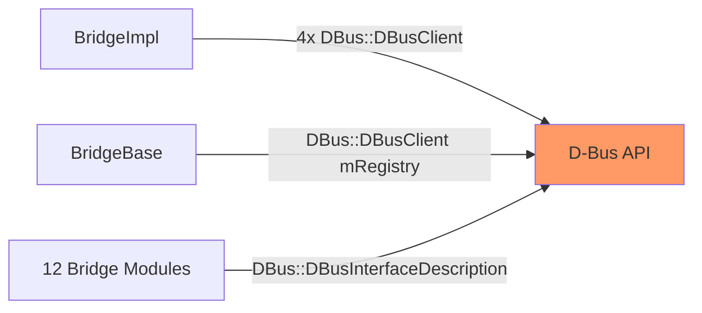

Bridge code에 D-Bus type이 직접 사용됨 → 다른 IPC backend 추가 불가

### Solution

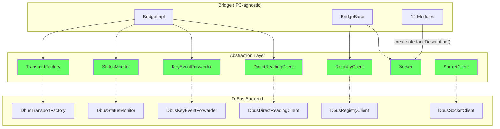

### Design Decisions

| Decision | Chosen | Rejected | Rationale |
|----------|--------|----------|-----------|
| Client abstraction | 5 domain-specific interfaces | Generic `Ipc::Client` with type-erased methods | Type safety, clear contracts, easy to mock |
| Factory pattern | Abstract Factory (`TransportFactory`) | Service Locator / DI container | Single entry point, same connection shared |
| InterfaceDescription creation | `Server::createInterfaceDescription()` | Direct construction | Bridge modules don't `#include` D-Bus headers |
| Helper template dispatch | `static_cast` to concrete type inside helpers | Full type erasure in `InterfaceDescription` | Pragmatic — avoids complex template machinery |
| Factory injection | Constructor (`BridgeImpl()`) | External via `CreateBridge()` | `mTransportFactory` is `protected` |

### Pros / Cons

| Pros | Cons |
|------|------|
| New IPC backends without bridge code changes | 12 new files |
| D-Bus types confined to `dbus/` directory | `static_cast` in helpers ties to one backend at a time |
| Each component independently mockable | InterfaceDescription registration not fully type-erased |
| Zero runtime overhead (virtual dispatch << IPC latency) | No runtime backend switching |
| Incremental migration, tests green throughout | — |

---

## 6. Phase 2.5: eldbus → GDBus (TODO)

### Problem

`dbus-tizen.cpp` uses EFL's `eldbus` → EFL dependency on all platforms

### Solution

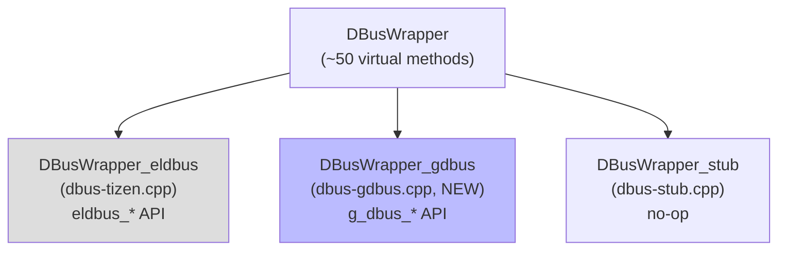

| Aspect | eldbus | GDBus |
|--------|--------|-------|
| Dependency | EFL (ecore, eldbus) | GLib (gio-2.0) |
| Platforms | Tizen only | Linux, macOS (Homebrew), Windows (MSYS2) |
| Message model | `Eldbus_Message_Iter` (sequential) | `GVariant` (tree-structured) |
| Thread safety | Single-threaded (ecore) | Thread-safe by default |
| Maintenance | Tizen-specific | Active GNOME project |

### Pros / Cons

| Pros | Cons |
|------|------|
| EFL dependency removed | ~2000 lines to reimplement |
| Works on macOS/Ubuntu/Android | GLib dependency added |
| `GVariant` is more type-safe | Different iteration model for containers |
| Active community maintenance | — |

---

## 7. Phase 2.6: TIDL Backend (TODO)

### Problem

D-Bus requires a daemon → overhead, no native Tizen security integration

### Solution

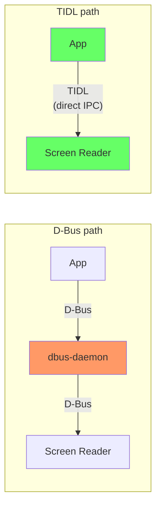

| Aspect | D-Bus | TIDL |
|--------|-------|------|
| Routing | Via dbus-daemon (central) | Direct P2P |
| Security | D-Bus policy files | Cynara (Tizen native) |
| Code generation | None (runtime registration) | `tidlc` codegen (compile-time) |
| Portability | Linux/macOS | Tizen only |
| Latency | Higher (daemon hop) | Lower (direct) |

### Pros / Cons

| Pros | Cons |
|------|------|
| No daemon → faster boot, less memory | Tizen only |
| Compile-time type checking (codegen) | Build complexity (tidlc) |
| Native Tizen security (Cynara) | Requires full-stack migration (both app and AT) |
| — | No AT-SPI compatibility with existing tools |

---

## 8. Phase 3: AccessibilityService Base Class (TODO)

### Problem

Screen reader (C), Inspector, Aurum each implement their own AT-SPI communication from scratch.

### Solution: Android-inspired AccessibilityService pattern

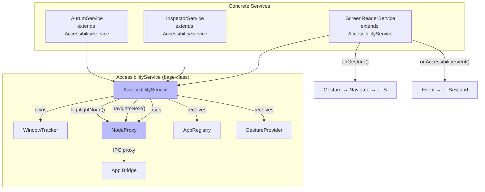

### Key Interfaces

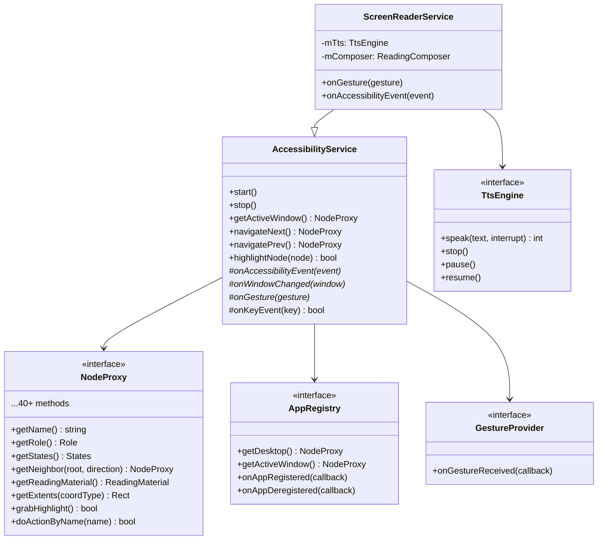

### Architecture: Proxy vs Cache

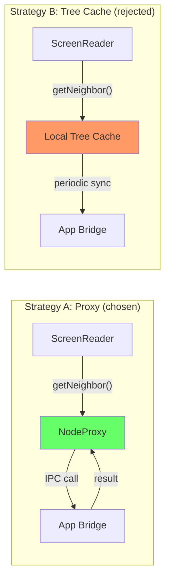

| Aspect | Proxy (A) | Cache (B) |
|--------|-----------|-----------|
| Complexity | Low | High (sync, invalidation) |
| Freshness | Always current | May be stale |
| Latency | 1 IPC per call | Near-zero after sync |
| Memory | O(1) per node | O(n) entire tree |
| Chosen? | **Yes** | No (add later if needed) |

**완화책**: `getReadingMaterial()` batch call이 name+role+states+value+parent를 한번에 fetch → round-trip 최소화

### Tree Embedding: Proxy vs Cache 분석

Tree embedding은 한 프로세스의 accessibility tree가 다른 프로세스의 tree에 자식으로 삽입되는 시나리오이다. 대표적인 예가 WebView: 네이티브 앱(host) 안에 웹 콘텐츠(guest)가 렌더링되고, 스크린 리더는 두 tree를 하나의 연속된 tree로 탐색해야 한다.

#### Strategy A (Proxy): Socket/Plug 기반 Embedding

Proxy 모델에서 tree embedding은 AT-SPI의 Socket/Plug protocol을 사용한다.

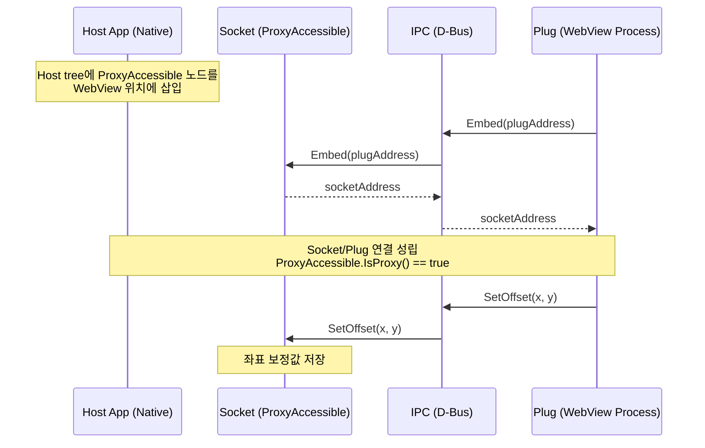

스크린 리더가 navigation 중 `ProxyAccessible`에 도달하면:

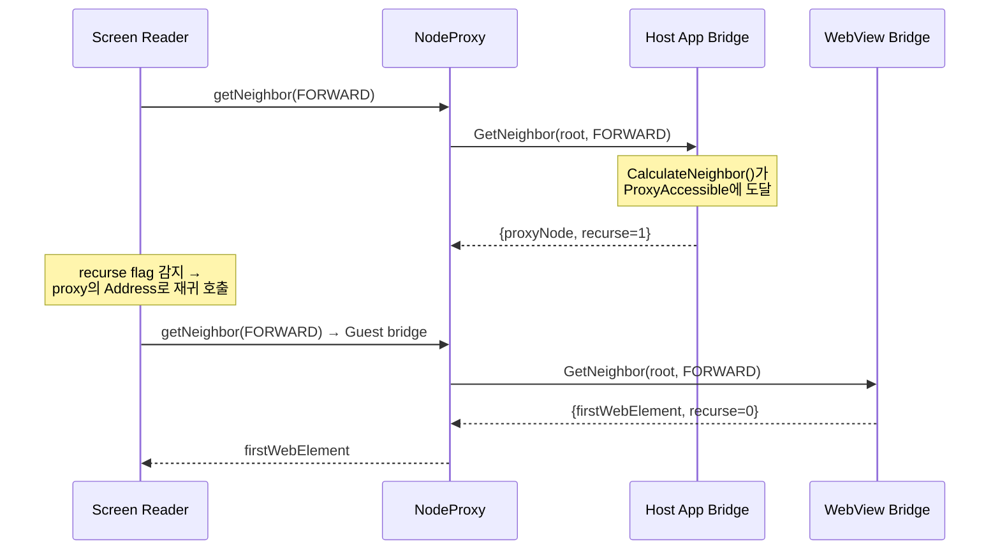

핵심 메커니즘:
- **`ProxyAccessible`**: `IsProxy() == true`인 빈 노드로, 다른 bridge의 `Address`를 보유
- **`recurse` flag**: `GetNeighbor()`와 `GetNavigableAtPoint()` 반환값에 포함. 스크린 리더가 이 flag를 보면 반환된 주소의 bridge로 동일한 호출을 재귀
- **`SetOffset(x, y)`**: 좌표계 변환. WebView의 DOM 좌표를 host 앱의 스크린 좌표로 보정
- **`Unembed()`**: WebView가 제거될 때 연결 해제

#### Strategy B (Cache): 데이터 관계 기반 Embedding

Cache 모델에서는 embedding이 극적으로 단순해진다.

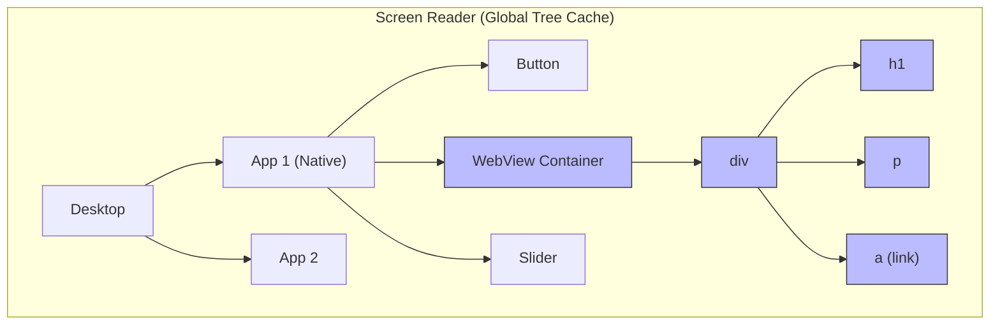

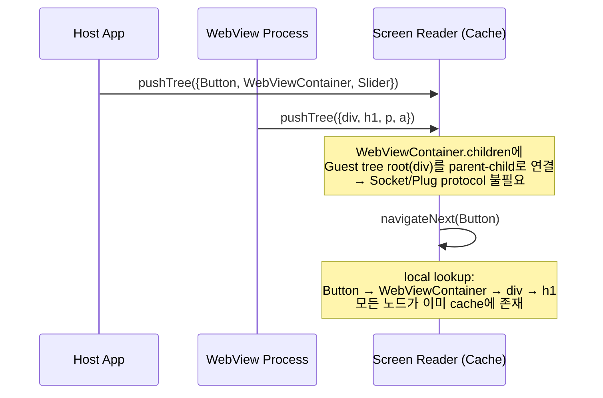

**Socket/Plug 자체가 불필요한 이유**: 스크린 리더가 모든 앱의 전체 tree를 이미 보유하므로, embedding은 단순히 cache 내에서 parent-child 포인터를 설정하는 것으로 충족된다. `ProxyAccessible`, `recurse` flag, `Embed()`/`Unembed()` 호출, `SetOffset()` 좌표 보정 — 이 모든 메커니즘이 사라진다. Navigation은 프로세스 경계를 의식할 필요 없이 단일 tree의 depth-first traversal이 된다.

#### 비교 분석

| Aspect | Proxy + Socket/Plug (A) | Cache + 데이터 관계 (B) |
|--------|------------------------|----------------------|
| Embedding protocol | `Embed`/`Unembed`/`SetOffset` IPC 필요 | parent-child 포인터만 설정 |
| 구현 복잡도 (embedding) | `ProxyAccessible`, `recurse` flag, 재귀 호출 로직 | 단순 tree merge |
| Navigation 코드 | `IsProxy()` 분기, 2-hop IPC | 분기 없는 단일 tree traversal |
| 좌표 보정 | `SetOffset()` per embedding | cache에서 offset 연산 (local) |
| Process boundary 인식 | 스크린 리더가 반드시 인식 | 투명 (transparent) |

#### Strategy B의 진짜 장점: Embedding 단순화

솔직히 인정해야 할 부분이 있다. Tree embedding이라는 특정 시나리오에서 Strategy B는 구조적으로 우월하다.

**Protocol 자체가 제거된다.** Strategy A에서 embedding을 위해 필요한 코드는 상당하다:
- `Socket` interface (`Embed`, `Unembed`, `SetOffset` — 3개의 IPC method)
- `Ipc::SocketClient` abstraction + `DbusSocketClient` backend
- `ProxyAccessible` class (180줄의 빈 override)
- `BridgeAccessible::GetNeighbor()`의 `recurse` flag 처리
- `BridgeAccessible::GetNavigableAtPoint()`의 `recurse` + `deputy` 처리
- 스크린 리더 쪽의 재귀 호출 로직

Strategy B에서 이 모든 것은 cache 내에서 `node.parent = hostContainer`와 `hostContainer.children.push_back(guestRoot)` 한 쌍으로 대체된다.

**Navigation이 근본적으로 단순해진다.** Strategy A에서 cross-process navigation은 항상 2-hop이다 (host bridge → `recurse` → guest bridge). Strategy B에서는 1-hop도 아닌 0-hop이다 — 모든 노드가 이미 local memory에 있다.

#### Strategy B의 비용: Embedding 관점에서도 무시할 수 없다

그러나 embedding이 단순해지는 대가는 크다. 특히 WebView처럼 **동적으로 변하는 embedded tree**에서 비용이 집중된다.

**1. 초기 동기화 비용**

```
WebView DOM tree: 수백~수천 노드
네이티브 앱 tree: 수십 노드

Strategy A: WebView process가 자체 bridge 운영 → 스크린 리더가 필요한 노드만 on-demand query
Strategy B: WebView가 전체 DOM accessibility tree를 스크린 리더에 push해야 함
```

일반적인 웹 페이지의 accessibility tree는 수백~수천 개 노드이다. 사용자가 실제로 접근하는 노드는 화면에 보이는 수십 개뿐인데, Strategy B는 전체를 push해야 한다.

**2. DOM 변경 시 Invalidation**

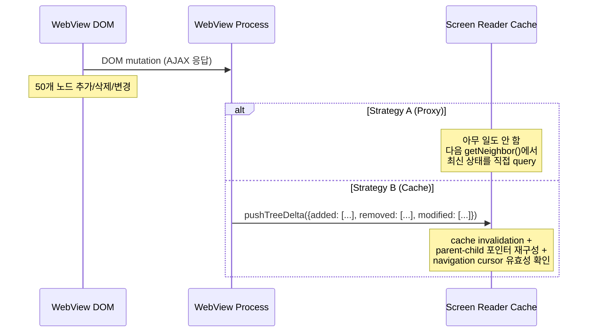

SPA(Single Page Application)에서 DOM은 끊임없이 변한다. Strategy A에서는 변경 사항이 무비용(zero-cost)이다 — query 시점에 항상 최신 상태를 반환한다. Strategy B에서는 모든 DOM mutation이 IPC push + cache update + consistency check를 trigger한다.

**3. Stale 데이터 문제**

Embedding에서 가장 위험한 시나리오는 **stale navigation**이다:

```
1. Cache에 WebView tree가 동기화됨 (노드 A → B → C)
2. 사용자가 link를 클릭 → DOM이 완전히 바뀜 (노드 X → Y → Z)
3. Cache update가 아직 도착하지 않은 상태에서
4. 스크린 리더가 navigateNext() → 이미 존재하지 않는 노드 B를 반환
```

Strategy A에서는 이 문제가 원천적으로 불가능하다. `GetNeighbor()`가 호출되는 시점에 WebView bridge가 현재 DOM을 직접 탐색하기 때문이다.

**4. 복수 Embedding의 확장 비용**

WebView 하나가 아니라 여러 개의 embedded content (WebView + PDF viewer + embedded app)가 있는 경우:

| Metric | Proxy (A) | Cache (B) |
|--------|-----------|-----------|
| 메모리 (3개 embedded, 각 500 노드) | O(1) — proxy 노드 3개 | O(1500) — 전체 tree 복사 |
| Embedding 설정 | `Embed()` x 3 | `pushTree()` x 3 |
| 동적 변경 시 | 영향 없음 | 3개 tree의 sync + invalidation |

#### 결론: Strategy A + Socket/Plug이 올바른 기본값

Tree embedding 시나리오만 놓고 보면 Strategy B의 단순함은 매력적이다. Socket/Plug protocol이라는 상당한 복잡도를 완전히 제거하고, navigation 코드에서 process boundary 분기를 없앨 수 있다.

그러나 그 단순함의 전제 조건은 **"모든 앱의 전체 tree를 항상 최신 상태로 cache에 유지"**이며, 이것이 WebView처럼 DOM이 동적으로 변하는 embedded content에서는 오히려 더 큰 복잡도를 만든다:

- **Push overhead**: 전체 tree를 push하는 비용이 Socket/Plug 설정 비용보다 큼
- **Invalidation complexity**: DOM mutation마다 cache sync가 필요하며, 이는 Socket/Plug protocol보다 복잡
- **Staleness risk**: Embedding된 tree의 stale 데이터는 navigation 오류를 직접 유발

Strategy A의 Socket/Plug protocol은 복잡하지만, 그 복잡도는 **embedding 설정 시점에 한정**된다 (`Embed`/`Unembed`/`SetOffset`). 일단 설정되면 runtime 비용은 `recurse` flag 확인 + 1회 추가 IPC뿐이다. 반면 Strategy B의 비용은 **embedded content가 존재하는 한 계속 발생**한다 (sync, invalidation, memory).

```
Strategy A 비용 분포: [설정 시 높음] → [runtime 낮음 (per-query IPC)]
Strategy B 비용 분포: [설정 시 낮음] → [runtime 높음 (continuous sync)]
```

따라서 **Strategy A (Proxy + Socket/Plug)를 기본값으로 유지**하되, Strategy B의 embedding 단순화는 향후 "정적이고 작은 embedded tree" (예: 고정된 about 페이지) 같은 특수 케이스에서 selective cache로 제한적으로 도입할 수 있는 최적화 옵션으로 남겨둔다.

### Design Decisions

| Decision | Chosen | Rejected | Rationale |
|----------|--------|----------|-----------|
| Navigation strategy | Proxy (Strategy A) | Local tree cache (B) | Simpler, always fresh, optimize later if needed |
| NodeProxy granularity | Single interface (~40 methods) | Split per AT-SPI interface | Screen reader needs all of them; splitting adds complexity |
| Base class vs composition | Base class with virtual hooks | Strategy/Observer pattern | Android pattern proven at scale; subclass = one service |
| Window tracking | Built into base class | External plugin | Every service needs it; common logic |
| IPC direction | AT queries App (pull) | App pushes to AT (push) | Matches AT-SPI model; AT controls navigation |

### Pros / Cons

| Pros | Cons |
|------|------|
| Screen reader/Inspector/Aurum share base class | NodeProxy methods are all IPC → latency |
| IPC backend swap transparent to service code | WindowTracker must be reimplemented from C |
| New AT = one subclass | AT-SPI protocol compatibility must be exact |
| Testable with mocks (MockNodeProxy, etc.) | Event loop integration varies by platform |

---

## 9. Phase 4: Service Implementations (TODO)

### 4a: Screen Reader (REQUIRED)

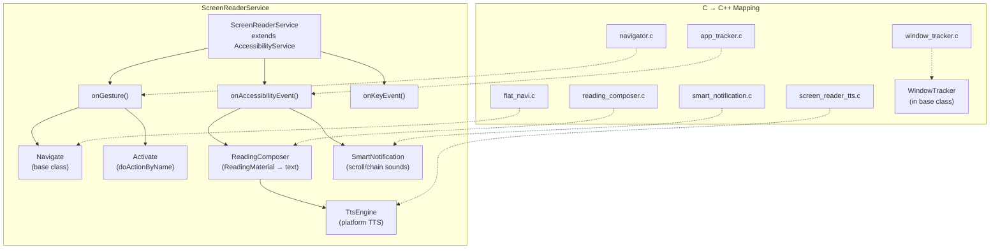

| C Source | Lines | C++ Replacement | Pure Logic? |
|----------|-------|-----------------|-------------|
| `navigator.c` | ~800 | `ScreenReaderService::onGesture()` | No (IPC) |
| `flat_navi.c` | ~400 | `AccessibilityService::navigateNext/Prev()` | No (IPC) |
| `reading_composer.c` | ~600 | `ReadingComposer` class | **Yes** |
| `smart_notification.c` | ~200 | `SmartNotification` class | **Yes** |
| `screen_reader_tts.c` | ~300 | `TtsEngine` (platform impl) | No (platform) |
| `window_tracker.c` | ~500 | `WindowTracker` (base class) | Partially |
| `keyboard_tracker.c` | ~200 | `onKeyEvent()` hook | No (platform) |
| `app_tracker.c` | ~600 | `onAccessibilityEvent()` | No (IPC) |

구현 순서: ReadingComposer → SmartNotification → TtsEngine → GestureProvider → ScreenReaderService → main

### 4b: Inspector (OPTIONAL)

기존 `DirectQueryEngine` + `WebInspectorServer` 위에 재구축. 현재 동작하므로 우선순위 낮음.

### 4c: Aurum (OPTIONAL)

기존 aurum이 AT-SPI 직접 사용. AccessibilityService API로 전환하면 screen reader와 동일 경로 → 테스트 일관성 향상.

### 4d: macOS NSAccessibility Backend (OPTIONAL)

Native macOS accessibility backend using `NSAccessibilityElement`. VoiceOver와 직접 통합.

| Component | Description |
|-----------|-------------|
| `DaliAccessibleNode` | `NSAccessibilityElement` subclass wrapping `Accessible` objects |
| VoiceOver 통합 | `accessibilityChildren`, `accessibilityHitTest`, `accessibilityFocusedUIElement` |
| Event notification | `NSAccessibilityPostNotification` for state/focus/value changes |
| Rendering surface | macOS `NSWindow` + OpenGL/Metal view 필요 |

D-Bus/AT-SPI가 아닌 macOS native accessibility protocol을 사용하므로, IPC 추상화 레이어와는 별도의 backend path.

---

## Phase 5: Toolkit Integration (Planned)

accessibility-common을 DALi의 dependency로 다시 통합. 현재 dali-adaptor 내의 accessibility 코드를 대체.

| Goal | Description |
|------|-------------|
| dali-adaptor dependency | `dali-adaptor`가 accessibility-common에 의존 (코드 포함 대신) |
| ControlAccessible | `dali-toolkit`의 `ControlAccessible`이 `Accessible` interface 구현 |
| Platform callbacks | DALi adaptor lifecycle에서 `PlatformCallbacks` 연결 |
| Zero behavior change | 기존 accessibility consumer 동작 변경 없음 |

---

## 10. Full Stack Data Flow

### App → Screen Reader (current AT-SPI path)

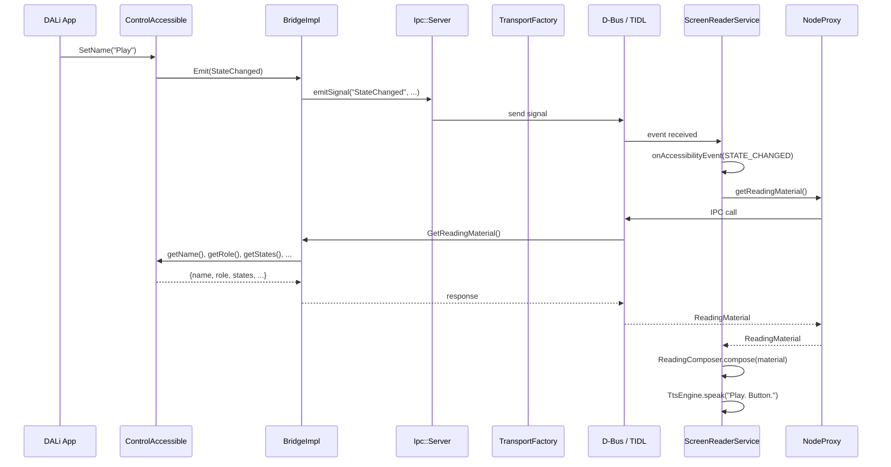

### PlatformCallbacks (bridge-platform.h)

Runtime callbacks that decouple the bridge from any specific event loop or toolkit. Set once at initialization via `SetPlatformCallbacks()`.

```
PlatformCallbacks
  +-- addIdle / removeIdle         # Idle task scheduling
  +-- createTimer / cancelTimer    # Repeating timers
  +-- getToolkitVersion / getAppName
  +-- isAdaptorAvailable
```

### Bridge Initialization (current)

```
1. Toolkit calls SetPlatformCallbacks(callbacks)
2. Toolkit calls Bridge::GetCurrentBridge() -> creates BridgeImpl singleton
3. Toolkit registers Accessible objects: bridge->AddAccessible(id, accessible)
4. Toolkit calls bridge->Initialize()
   - Reads IsEnabled / ScreenReaderEnabled properties from AT-SPI bus
5. Toolkit calls bridge->ApplicationResumed()
   - Triggers SwitchBridge() -> ForceUp()
   - ForceUp: connects to AT-SPI bus, registers all D-Bus interfaces, embeds socket
6. Bridge is now live, responding to AT-SPI queries from screen readers
```

### AT-SPI Method Call (e.g., GetRole)

```
Screen Reader                    Bridge                         Accessible
    |                              |                               |
    |-- D-Bus: GetRole(path) ----->|                               |
    |                              |-- FindCurrentObject(path) --->|
    |                              |<-- Accessible* --------------|
    |                              |-- accessible->GetRole() ----->|
    |                              |<-- Role::PUSH_BUTTON --------|
    |<-- D-Bus reply: 42 ---------|                               |
```

### Gesture → Navigation

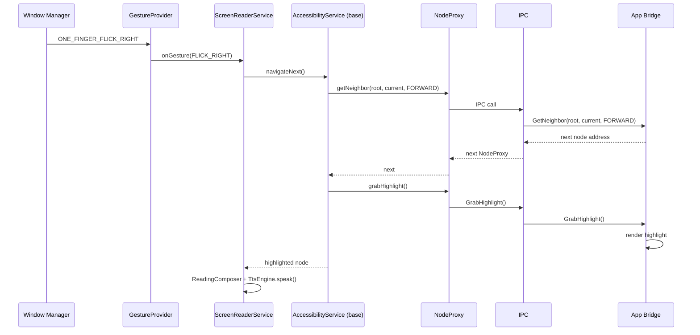

---

## 11. Repository Structure (Target)

```
accessibility-common/
├── accessibility/
│   ├── api/                          # Public API
│   │   ├── accessible.h              # Accessible interface
│   │   ├── accessibility-bridge.h    # Bridge interface
│   │   ├── component.h               # Component (extents, layer)
│   │   ├── types.h                   # Role, State, enums
│   │   ├── accessibility-service.h   # ← Phase 3: base class
│   │   ├── node-proxy.h             # ← Phase 3: AT-side node interface
│   │   ├── app-registry.h           # ← Phase 3: app discovery
│   │   └── ...
│   │
│   ├── internal/
│   │   ├── bridge/                   # App-side bridge
│   │   │   ├── ipc/                  # IPC abstraction (Phase 2)
│   │   │   │   ├── ipc-server.h
│   │   │   │   ├── ipc-transport-factory.h
│   │   │   │   ├── ipc-status-monitor.h
│   │   │   │   ├── ipc-key-event-forwarder.h
│   │   │   │   ├── ipc-direct-reading-client.h
│   │   │   │   ├── ipc-registry-client.h
│   │   │   │   └── ipc-socket-client.h
│   │   │   │
│   │   │   ├── dbus/                 # D-Bus backend
│   │   │   │   ├── dbus.h            # Core DBus abstraction
│   │   │   │   ├── dbus-tizen.cpp    # eldbus (current)
│   │   │   │   ├── dbus-gdbus.cpp   # ← Phase 2.5: GDBus
│   │   │   │   ├── dbus-stub.cpp     # stub (macOS/CI)
│   │   │   │   ├── dbus-transport-factory.h
│   │   │   │   └── dbus-*-client.h   # 5 D-Bus client impls
│   │   │   │
│   │   │   ├── tidl/                # ← Phase 2.6: TIDL backend
│   │   │   │   ├── tidl-transport-factory.h
│   │   │   │   └── tidl-*-client.h
│   │   │   │
│   │   │   ├── bridge-base.h/.cpp
│   │   │   ├── bridge-impl.cpp
│   │   │   └── bridge-*.cpp          # 12 bridge modules
│   │   │
│   │   └── service/                  # ← Phase 3: AT-side service
│   │       ├── atspi-node-proxy.cpp
│   │       ├── atspi-app-registry.cpp
│   │       ├── atspi-event-router.cpp
│   │       └── window-tracker.cpp
│   │
│   └── service/                      # ← Phase 4: service implementations
│       └── screen-reader/
│           ├── screen-reader-service.h/.cpp
│           ├── reading-composer.h/.cpp
│           └── smart-notification.h/.cpp
│
├── tools/
│   ├── inspector/                    # CLI/Web inspector (exists)
│   └── screen-reader/               # ← Phase 4: screen reader binary
│       └── main.cpp
│
├── test/                             # Tests (31 existing + growing)
├── build/tizen/                      # CMake build
└── docs/
    ├── architecture-overview.md      # This document
    └── phase2-ipc-abstraction.md     # Phase 2 detailed design
```

---

## 12. Key Abstractions Across Phases

```mermaid
graph TB
    subgraph "Phase 1: Separation"
        A1["Accessible (interface)"]
        A2["Bridge (interface)"]
        A3["PlatformCallbacks"]
    end

    subgraph "Phase 2: IPC Abstraction"
        B1["TransportFactory"]
        B2["Server + InterfaceDescription"]
        B3["5 Client Interfaces"]
    end

    subgraph "Phase 2.5/2.6: Backends"
        C1["GDBus Backend"]
        C2["TIDL Backend"]
    end

    subgraph "Phase 3: Service Framework"
        D1["AccessibilityService"]
        D2["NodeProxy"]
        D3["AppRegistry + GestureProvider"]
    end

    subgraph "Phase 4: Implementations"
        E1["ScreenReaderService"]
        E2["ReadingComposer"]
        E3["TtsEngine"]
    end

    A1 --> B2
    A2 --> B1
    B1 --> C1
    B1 --> C2
    B3 --> D2
    D1 --> E1
    D2 --> E1
    D3 --> E1
    E1 --> E2
    E1 --> E3

    style A1 fill:#ddd
    style A2 fill:#ddd
    style A3 fill:#ddd
    style B1 fill:#6f6
    style B2 fill:#6f6
    style B3 fill:#6f6
    style C1 fill:#bbf
    style C2 fill:#bbf
    style D1 fill:#fbf
    style D2 fill:#fbf
    style D3 fill:#fbf
    style E1 fill:#ff9
    style E2 fill:#ff9
    style E3 fill:#ff9
```

---

## 13. Decision Log (Cross-Phase)

| # | Phase | Decision | Chosen | Rationale |
|---|-------|----------|--------|-----------|
| 1 | 1 | Library structure | Standalone `.so` | Independent of DALi lifecycle |
| 2 | 1 | Accessible ownership | Raw pointers + shared_ptr features | Matches toolkit actor lifecycle |
| 3 | 1 | Platform decoupling | `PlatformCallbacks` function pointers | No base class dependency on toolkit |
| 4 | 2 | Client abstraction style | 5 domain-specific interfaces | Type safety, mockability |
| 5 | 2 | Backend creation | Abstract Factory (`TransportFactory`) | Single entry point for backend |
| 6 | 2 | Interface registration | `static_cast` in helpers | Pragmatic; avoids type erasure |
| 7 | 2.5 | D-Bus library | GDBus (GLib) over eldbus (EFL) | Broader platform support |
| 8 | 2.6 | Alternative IPC | TIDL | D-Bus daemon 제거, Tizen native IPC |
| 9 | 3 | Navigation model | Proxy (not tree cache) | Simpler, always fresh |
| 10 | 3 | Service pattern | Android AccessibilityService | Proven at scale |
| 11 | 3 | NodeProxy scope | Single interface (~40 methods) | All methods needed by screen reader |
| 12 | 3 | Registry daemon | Not needed (use existing amd) | Avoid new daemon |
| 13 | 4 | Screen reader language | C++ (not C) | Type safety, share base class |
| 14 | 4 | TTS composition | Separate `ReadingComposer` class | Pure logic, testable |

---

## 14. Risk Matrix

| Risk | Phase | Impact | Likelihood | Mitigation |
|------|-------|--------|------------|------------|
| GDBus `GVariant` mismatch with nested containers | 2.5 | High | Medium | Extensive unit tests per type |
| TIDL lacks D-Bus introspection / property signals | 2.6 | Medium | High | Implement equivalent in TIDL interface |
| NodeProxy IPC latency hurts screen reader performance | 3 | High | Low | `getReadingMaterial()` batch call |
| AtSpiNodeProxy doesn't match bridge protocol exactly | 3 | High | Medium | Test against real AT-SPI apps |
| Event loop integration differs per platform | 3-4 | Medium | Medium | `PlatformCallbacks` extension |
| C → C++ screen reader logic port introduces bugs | 4 | Medium | Medium | Port pure logic first (ReadingComposer) |

---

## 15. Verification Strategy

| Phase | Test Method | Expected |
|-------|------------|----------|
| 1 | `accessibility-test` | 31 passed |
| 2 | `accessibility-test` (unchanged) | 31 passed |
| 2.5 | + GDBus integration test on session bus | 31 + N passed |
| 2.7 | + Tree embedding unit tests | 31 + 10 passed |
| 3 | + AccessibilityService unit tests (mock providers) | 31 + N passed |
| 4a | Screen reader binary vs AT-SPI apps | End-to-end TTS |
| 5 | Full stack rebuild + existing AT-SPI consumers | Zero behavior change |
| Full stack | accessibility-common → dali-adaptor → dali-toolkit → dali-demo | GUI app with a11y |

### Current Test Coverage (31 tests)

| Category | Tests |
|----------|-------|
| Bridge lifecycle | Initialize, ForceUp, Terminate |
| Accessible interface | GetRole, GetName, GetChildCount, GetChildAtIndex, GetState |
| Component interface | GetExtents |
| Bridge API | FindByPath, AddTopLevelWindow |
| D-Bus serialization | string, uint32, enum, struct, array, bitset, Address round-trips |

---

## 16. Mock Architecture

The `MockDBusWrapper` enables testing the full bridge pipeline in-process without a real D-Bus daemon:

```
Test App
  |
  +-- Install MockDBusWrapper
  +-- Create TestAccessible tree
  +-- bridge->Initialize() + ApplicationResumed()
  |     |
  |     +-- ForceUp registers interfaces in MockDBusWrapper's registry
  |     +-- Canned responses handle init calls (GetAddress, Embed, etc.)
  |
  +-- DBusClient.method("GetRole").call()
        |
        +-- Creates MockMessage with path/interface/member
        +-- MockDBusWrapper::eldbus_proxy_send_and_block_impl()
        +-- RouteMethodCall: looks up (path, interface, member) in registry
        +-- Invokes registered callback (same code path as production)
        +-- Returns MockMessage with serialized response
        +-- DBusClient deserializes response using same dbus.h templates
```

### Canned Responses

The mock pre-populates responses for external AT-SPI services called during bridge initialization:

| Service | Method | Response |
|---|---|---|
| org.a11y.Bus | GetAddress | `"unix:path=/tmp/mock-atspi"` |
| org.a11y.atspi.Registry | GetRegisteredEvents | Empty event list |
| org.a11y.atspi.Socket | Embed | Dummy parent Address |
| org.a11y.atspi.Socket | Unembed | Success (no-op) |
| org.a11y.Status | IsEnabled | `true` |
| org.a11y.Status | ScreenReaderEnabled | `true` |

---

## 17. Inspector Architecture

Both the CLI and web inspectors share a common engine (`AccessibilityQueryEngine`) that encapsulates bridge initialization, demo tree construction, D-Bus queries, and navigation.

```
                    AccessibilityQueryEngine
                   (query-engine.h/.cpp)
                    |                    |
          +---------+----------+   +----+-----+
          |                    |   |          |
   CLI Inspector        Web Inspector    (future consumers)
   (inspector.cpp)      (web-inspector.cpp)
          |                    |
   stdin/stdout         HTTP REST API
                        (cpp-httplib)
                              |
                         Browser UI
                   (web-inspector-resources.h)
```

### AccessibilityQueryEngine (tools/inspector/query-engine.h/.cpp)

Reusable engine that initializes a demo accessible tree and provides query/navigation methods. Consumers call engine methods instead of making raw D-Bus queries.

```
AccessibilityQueryEngine
  +-- Initialize()              # MockDBusWrapper + PlatformCallbacks + bridge + demo tree
  +-- Shutdown()                # Bridge teardown
  +-- GetRootId() / GetFocusedId() / SetFocusedId()
  +-- GetElementInfo(id)        # Returns ElementInfo (name, role, states, bounds, children)
  +-- BuildTree(rootId)         # Returns TreeNode hierarchy
  +-- Navigate(id, forward)     # Forward/backward via bridge GetNeighbor
  +-- NavigateChild(id)         # First child
  +-- NavigateParent(id)        # Parent
```

Internally, the engine uses `DBusClient` to query the bridge's registered AT-SPI interfaces through MockDBusWrapper — the same code path as a real screen reader.

```
AccessibilityQueryEngine
  |
  +-- DBusClient.method("GetRole").call()
  |     |
  v     v
Bridge (BridgeImpl)
  |
  +-- Registered AT-SPI interfaces (same code as production)
  |
  v
MockDBusWrapper (in-process routing)
```

### Demo Tree

The engine builds a demo tree modeling a Tizen media player app:

```
[WINDOW] "Main Window"                       <- ACTIVE
  [PANEL] "Header"
    [PUSH_BUTTON] "Menu"                     <- FOCUSABLE + HIGHLIGHTABLE
    [LABEL] "My Tizen App"                   <- HIGHLIGHTABLE (not FOCUSABLE)
  [PANEL] "Content"
    [PUSH_BUTTON] "Play"                     <- FOCUSABLE + HIGHLIGHTABLE
    [SLIDER] "Volume"                        <- FOCUSABLE + HIGHLIGHTABLE
    [LABEL] "Now Playing: Bohemian Rhapsody" <- HIGHLIGHTABLE (not FOCUSABLE)
  [PANEL] "Footer"
    [PUSH_BUTTON] "Previous"                 <- FOCUSABLE + HIGHLIGHTABLE
    [PUSH_BUTTON] "Next"                     <- FOCUSABLE + HIGHLIGHTABLE
```

**FOCUSABLE vs HIGHLIGHTABLE**: Buttons and sliders are both FOCUSABLE (can receive keyboard focus) and HIGHLIGHTABLE (navigable by screen reader cursor). Labels are HIGHLIGHTABLE only — the screen reader can navigate to them and announce their text, but they don't accept keyboard focus. The bridge's `GetNeighbor()` walks elements with HIGHLIGHTABLE state; `IsObjectAcceptable()` in `bridge-accessible.cpp` checks VISIBLE + HIGHLIGHTABLE.

### CLI Inspector (tools/inspector/inspector.cpp)

Thin interactive wrapper (~220 lines) over `AccessibilityQueryEngine`. Provides single-key commands for tree exploration and TTS:

| Key | Action |
|-----|--------|
| `p` | Print accessibility tree (`>>` marks focused element) |
| `n`/`b` | Navigate forward/backward |
| `c`/`u` | Navigate to first child / parent |
| `r` | Read current element details |
| `s` | Speak current element via system TTS |
| `h` | Show help |
| `q` | Quit |

TTS uses `AVSpeechSynthesizer` on macOS (`tts-mac.mm`) and prints to console elsewhere (`tts-stub.cpp`).

### Web Inspector (tools/inspector/web-inspector.cpp)

Browser-based GUI served via embedded HTTP server (~230 lines). Uses cpp-httplib (single-header, MIT licensed, vendored at `third-party/cpp-httplib/httplib.h`).

**REST API:**

| Endpoint | Method | Description |
|----------|--------|-------------|
| `/` | GET | Serves embedded HTML/CSS/JS page |
| `/api/tree` | GET | Full tree JSON + current focusedId |
| `/api/element/:id` | GET | Element details (name, role, states, bounds, children, parent) |
| `/api/navigate` | POST | Navigate: `{"direction": "next\|prev\|child\|parent"}` |

**Frontend** (`web-inspector-resources.h`): Embedded as a C++ raw string literal (`R"HTMLPAGE(...)HTMLPAGE"`) for single-binary deployment. Features:
- Dark Catppuccin-themed two-panel layout (tree + detail)
- Click-to-select tree nodes with collapse/expand
- Navigation buttons: Prev, Next, Child, Parent, Refresh
- Keyboard shortcuts: Tab/Shift+Tab, Enter, Backspace, S (speak), R (refresh)
- TTS via Web Speech API (browser-side, no server dependency)

A mutex protects the engine from concurrent HTTP request handlers. JSON is serialized manually (no external JSON library — only 3 endpoints).

---

## 18. Build System

The CMake build supports three configurations controlled by `ENABLE_ATSPI` and `eldbus_available`:

```
ENABLE_ATSPI=ON + eldbus:    Full bridge + dbus-tizen.cpp (production)
ENABLE_ATSPI=ON + no eldbus: Full bridge + dbus-stub.cpp  (test/CI)
ENABLE_ATSPI=OFF:            DummyBridge only              (no a11y)
```

### dbus-stub.cpp

Provides the same portable symbols as `dbus-tizen.cpp` (static variables, `DBusClient`/`DBusServer` constructors, `DBusWrapper::Install`/`Installed`) but without the EFL `DefaultDBusWrapper`. Callers must install their own `DBusWrapper` via `Install()` before any D-Bus operations.

### Test Build

`BUILD_TESTS=ON` adds the `accessibility-test` executable. The test compiles all bridge sources directly rather than linking against the shared library, because the library uses `-fvisibility=hidden` which hides internal symbols (`DBusWrapper`, `DBusClient`, etc.) that the test needs to access.

```
cmake .. -DENABLE_ATSPI=ON -DBUILD_TESTS=ON -DENABLE_PKG_CONFIGURE=OFF
make
./accessibility-test
```

### Inspector Build

Both inspectors compile bridge sources directly (like tests) and use MockDBusWrapper for in-process IPC.

```
# CLI inspector
cmake .. -DENABLE_ATSPI=ON -DBUILD_INSPECTOR=ON -DENABLE_PKG_CONFIGURE=OFF
make && ./accessibility-inspector

# Web inspector
cmake .. -DENABLE_ATSPI=ON -DBUILD_WEB_INSPECTOR=ON -DENABLE_PKG_CONFIGURE=OFF
make && ./accessibility-web-inspector
```

---

## 19. Known Limitations

- `Accessible*` deserialization from D-Bus messages requires `CurrentBridgePtr` context (only available during server-side callback processing). Client-side tests verify the serialized `Address` instead.
- The mock's `addIdle`/`createTimer` callbacks execute synchronously and immediately. This is sufficient for testing but does not simulate real async behavior.
