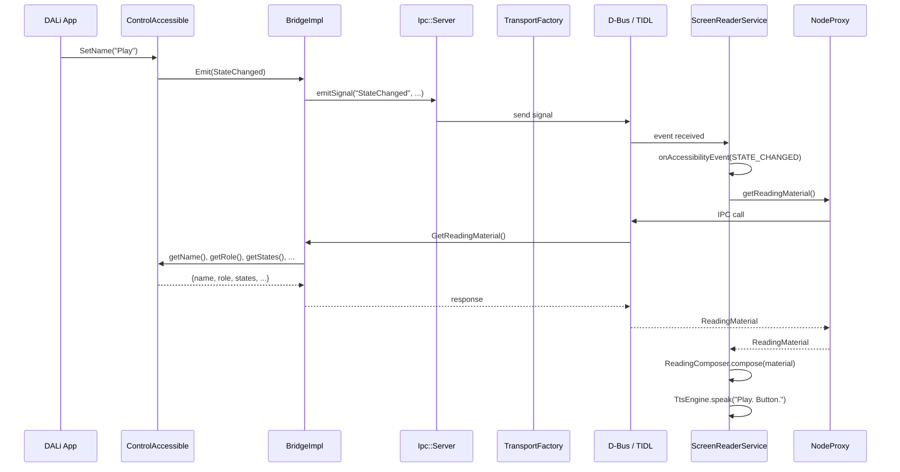
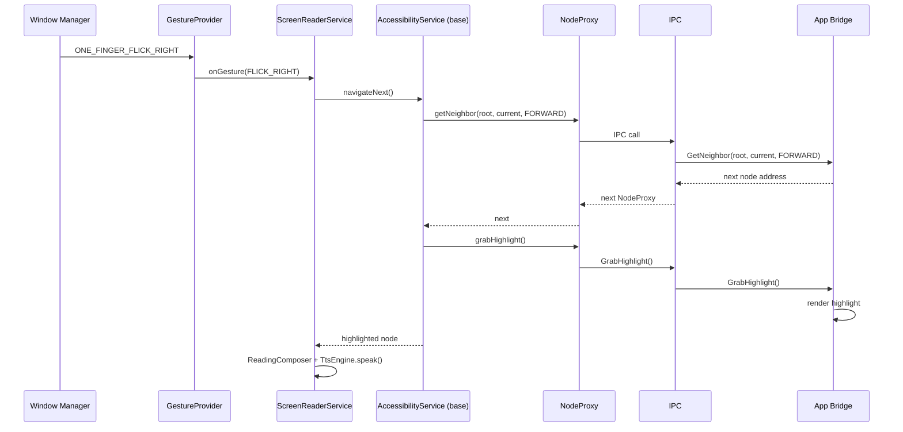

# Full Stack Data Flow

> Parent document: [architecture-overview.md](architecture-overview.md)

---

## App → Screen Reader (current AT-SPI path)



---

## PlatformCallbacks (bridge-platform.h)

Runtime callbacks that decouple the bridge from any specific event loop or toolkit. Set once at initialization via `SetPlatformCallbacks()`.

```
PlatformCallbacks
  +-- addIdle / removeIdle         # Idle task scheduling
  +-- createTimer / cancelTimer    # Repeating timers
  +-- getToolkitVersion / getAppName
  +-- isAdaptorAvailable
```

---

## Bridge Initialization

```
1. Toolkit calls SetPlatformCallbacks(callbacks)
2. Toolkit calls Bridge::GetCurrentBridge() -> creates BridgeImpl singleton
3. Toolkit registers Accessible objects: bridge->AddAccessible(id, accessible)
4. Toolkit calls bridge->Initialize()
   - Reads IsEnabled / ScreenReaderEnabled properties from AT-SPI bus
5. Toolkit calls bridge->ApplicationResumed()
   - Triggers SwitchBridge() -> ForceUp()
   - ForceUp: connects to AT-SPI bus, registers all D-Bus interfaces, embeds socket
6. Bridge is now live, responding to AT-SPI queries from screen readers
```

---

## AT-SPI Method Call (e.g., GetRole)

```
Screen Reader                    Bridge                         Accessible
    |                              |                               |
    |-- D-Bus: GetRole(path) ----->|                               |
    |                              |-- FindCurrentObject(path) --->|
    |                              |<-- Accessible* --------------|
    |                              |-- accessible->GetRole() ----->|
    |                              |<-- Role::PUSH_BUTTON --------|
    |<-- D-Bus reply: 42 ---------|                               |
```

---

## Gesture → Navigation


