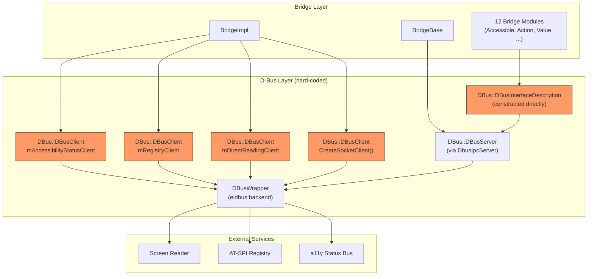
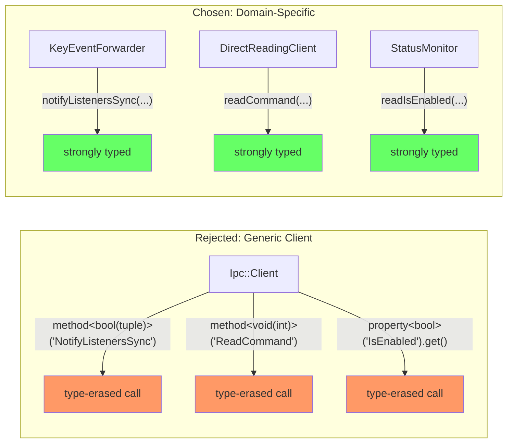
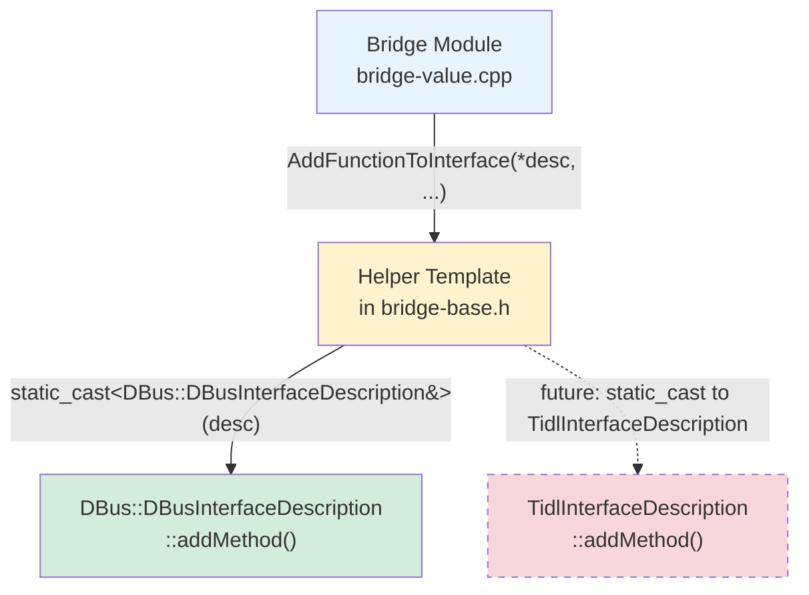
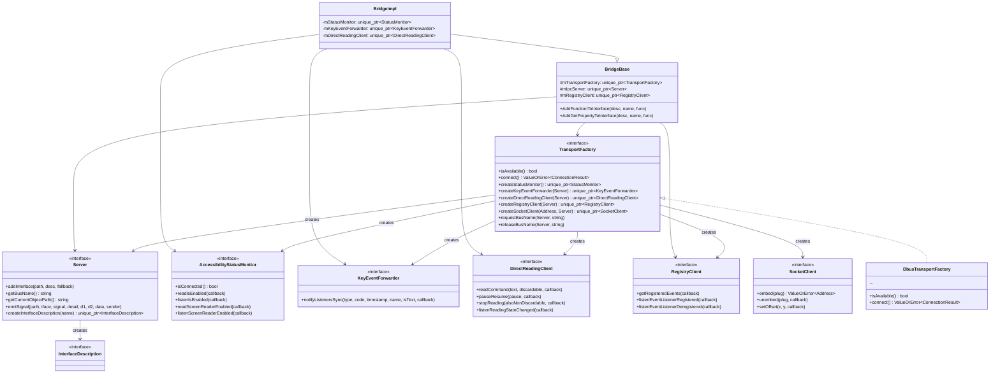
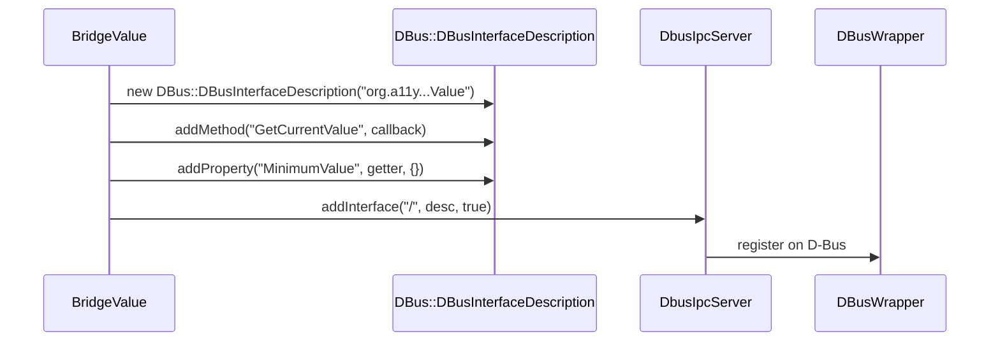
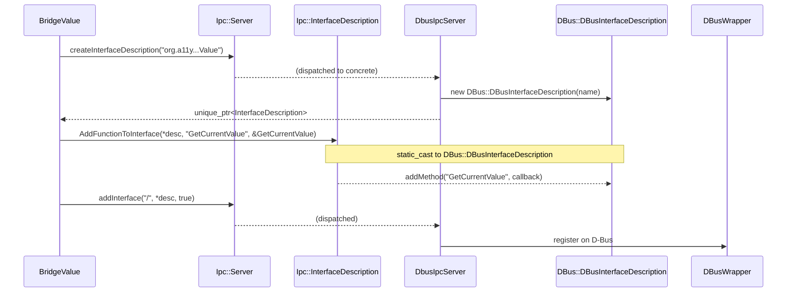
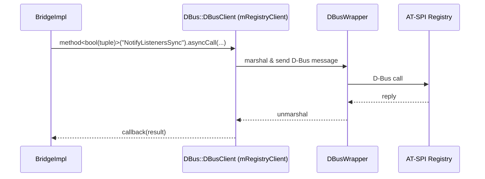
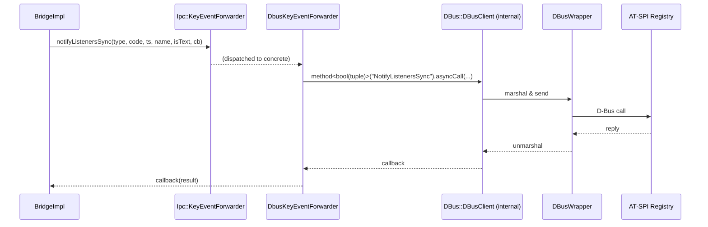
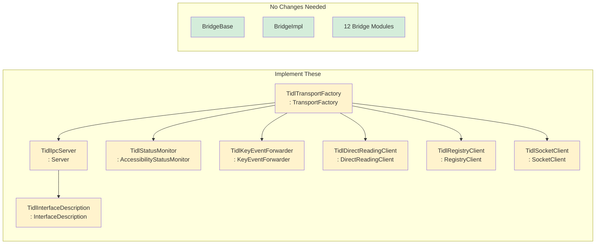

# Phase 2: Bidirectional IPC Abstraction — Architecture Document

## 1. Overview

Phase 2 refactors the accessibility bridge to decouple all IPC (Inter-Process Communication) operations from D-Bus, making the transport layer pluggable. The bridge code now programs against abstract interfaces; D-Bus becomes one backend among potentially many (TIDL, GDBus, in-process).

---

## 2. High-Level Architecture Comparison

### Before (Phase 1)



**Problems:**
- 4 `DBus::DBusClient` instances scattered across BridgeImpl
- `DBus::DBusInterfaceDescription` constructed directly in 12 modules
- `getConnection()` / `getDbusServer()` exposed D-Bus internals
- Adding a new IPC backend requires modifying bridge code

### After (Phase 2)

```mermaid
graph TB
    subgraph "Bridge Layer (IPC-agnostic)"
        BI[BridgeImpl]
        BB[BridgeBase]
        BM["12 Bridge Modules<br/>(Accessible, Action, Value, ...)"]
    end

    subgraph "IPC Abstraction Layer"
        TF["Ipc::TransportFactory"]
        IS["Ipc::Server"]
        SM["Ipc::AccessibilityStatusMonitor"]
        KF["Ipc::KeyEventForwarder"]
        DRC["Ipc::DirectReadingClient"]
        RC["Ipc::RegistryClient"]
        SC["Ipc::SocketClient"]
        ID["Ipc::InterfaceDescription"]
    end

    subgraph "D-Bus Backend"
        DTF["DbusTransportFactory"]
        DIS["DbusIpcServer"]
        DSM["DbusStatusMonitor"]
        DKF["DbusKeyEventForwarder"]
        DDRC["DbusDirectReadingClient"]
        DRCC["DbusRegistryClient"]
        DSC["DbusSocketClient"]
        DID["DBus::DBusInterfaceDescription"]
        DBW["DBusWrapper<br/>(eldbus backend)"]
    end

    subgraph "Future Backends"
        TIDL["TidlTransportFactory<br/>(planned)"]
        GDBUS["GDbusTransportFactory<br/>(planned)"]
    end

    subgraph "External Services"
        SR[Screen Reader]
        REG[AT-SPI Registry]
        A11Y[a11y Status Bus]
    end

    BI --> TF
    BI --> SM
    BI --> KF
    BI --> DRC
    BB --> TF
    BB --> IS
    BB --> RC
    BM --> ID
    IS -.->|createInterfaceDescription| ID

    TF -.->|implements| DTF
    IS -.->|implements| DIS
    SM -.->|implements| DSM
    KF -.->|implements| DKF
    DRC -.->|implements| DDRC
    RC -.->|implements| DRCC
    SC -.->|implements| DSC
    ID -.->|implements| DID

    TF -.->|future| TIDL
    TF -.->|future| GDBUS

    DTF --> DBW
    DIS --> DBW
    DSM --> DBW
    DKF --> DBW
    DDRC --> DBW
    DRCC --> DBW
    DSC --> DBW

    DBW --> A11Y
    DBW --> REG
    DBW --> SR

    style TF fill:#6f6,stroke:#333
    style IS fill:#6f6,stroke:#333
    style SM fill:#6f6,stroke:#333
    style KF fill:#6f6,stroke:#333
    style DRC fill:#6f6,stroke:#333
    style RC fill:#6f6,stroke:#333
    style SC fill:#6f6,stroke:#333
    style ID fill:#6f6,stroke:#333
```



---

## 3. Design Decisions

### Decision 1: Domain-Specific Interfaces vs Generic Client

**Rejected alternative:** Add type-erased `method<Ret(Args...)>("name").call(args)` to a generic `Ipc::Client` interface.

**Chosen approach:** 5 domain-specific abstract interfaces, each with strongly-typed methods.

```
Ipc::AccessibilityStatusMonitor   — readIsEnabled(), listenScreenReaderEnabled(), ...
Ipc::KeyEventForwarder            — notifyListenersSync(...)
Ipc::DirectReadingClient          — readCommand(), pauseResume(), stopReading(), ...
Ipc::RegistryClient               — getRegisteredEvents(), listenEventListener*()
Ipc::SocketClient                 — embed(), unembed(), setOffset()
```

**Rationale:**
- Type safety at compile time (no string-based method dispatch)
- Each interface has a small, well-defined API surface
- Backend implementors know exactly what to implement
- Easy to mock for testing



### Decision 2: Abstract Factory (TransportFactory) vs Service Locator

**Rejected alternative:** Global service locator / registry pattern where components look up IPC implementations at runtime.

**Chosen approach:** `Ipc::TransportFactory` abstract factory, injected into BridgeImpl at construction time.

```cpp
// BridgeImpl constructor
BridgeImpl() {
  mTransportFactory = std::make_unique<Ipc::DbusTransportFactory>();
}

// Usage in ForceUp()
auto connection = mTransportFactory->connect();
mRegistryClient = mTransportFactory->createRegistryClient(*mIpcServer);
mKeyEventForwarder = mTransportFactory->createKeyEventForwarder(*mIpcServer);
```

**Rationale:**
- Single point of backend selection
- All components from the same factory share the same connection
- Easy to swap the entire IPC stack by changing one line
- Testable — inject a mock factory for unit tests

### Decision 3: static_cast in Helper Templates

**Problem:** 12 bridge modules register methods/properties via `AddFunctionToInterface(desc, ...)`. These helpers need access to backend-specific APIs (e.g., `DBusInterfaceDescription::addMethod<>`), but the interface description parameter is now abstract.

**Rejected alternatives:**
1. Fully type-erased `InterfaceDescription::addMethod()` — requires complex type erasure machinery, hard to maintain
2. Each backend provides its own set of helper templates — code duplication across backends

**Chosen approach:** Helpers accept `Ipc::InterfaceDescription&` and internally `static_cast` to the concrete type.

```cpp
template<typename SELF, typename... RET, typename... ARGS>
void AddFunctionToInterface(
  Ipc::InterfaceDescription& desc,        // abstract parameter
  const std::string& funcName,
  DBus::ValueOrError<RET...> (SELF::*funcPtr)(ARGS...))
{
  auto& dbusDesc = static_cast<DBus::DBusInterfaceDescription&>(desc);  // cast to concrete
  dbusDesc.addMethod<DBus::ValueOrError<RET...>(ARGS...)>(...);
}
```

**Rationale:**
- Bridge modules only see `Ipc::InterfaceDescription&` — no D-Bus types in their code
- Zero template machinery overhead — the `static_cast` compiles to nothing
- Trade-off acknowledged: adding a new backend requires a parallel set of helpers (or full type erasure at that point)



### Decision 4: createInterfaceDescription() Factory Method

**Before:** Each bridge module constructed `DBus::DBusInterfaceDescription` directly.

**After:** `Ipc::Server::createInterfaceDescription()` returns `unique_ptr<InterfaceDescription>`.

```cpp
// Before
DBus::DBusInterfaceDescription desc{Accessible::GetInterfaceName(AtspiInterface::VALUE)};
AddGetSetPropertyToInterface(desc, "CurrentValue", &BridgeValue::GetCurrentValue, ...);
mIpcServer->addInterface("/", desc, true);

// After
auto desc = mIpcServer->createInterfaceDescription(Accessible::GetInterfaceName(AtspiInterface::VALUE));
AddGetSetPropertyToInterface(*desc, "CurrentValue", &BridgeValue::GetCurrentValue, ...);
mIpcServer->addInterface("/", *desc, true);
```

**Rationale:**
- Bridge modules no longer `#include` D-Bus headers
- Server implementation controls the concrete type
- Change is mechanical — same pattern applied uniformly to all 12 modules

### Decision 5: Constructor Injection vs CreateBridge() Injection

**Problem:** `mTransportFactory` is `protected` in `BridgeBase`. `CreateBridge()` is a free function that cannot access it.

**Rejected alternative:** Make `mTransportFactory` public, or add a setter.

**Chosen approach:** `BridgeImpl` constructor initializes the factory (a derived class can access its own protected members).

```cpp
BridgeImpl() {
  mTransportFactory = std::make_unique<Ipc::DbusTransportFactory>();
}
```

**Rationale:**
- Keeps `mTransportFactory` protected — only subclasses can change it
- Factory is set before any other code runs
- `CreateBridge()` becomes a simple `return std::make_shared<BridgeImpl>()`

---

## 4. Component Dependency Diagram



---

## 5. Data Flow: Method Registration (Before vs After)

### Before



### After



---

## 6. Data Flow: Client Operations (Before vs After)

### Before: EmitKeyEvent



### After: EmitKeyEvent



---

## 7. File Structure

```
accessibility/internal/bridge/
├── ipc/                              # Abstract IPC interfaces
│   ├── ipc-server.h                  # Server (+ createInterfaceDescription)
│   ├── ipc-client.h                  # Client (legacy, may deprecate)
│   ├── ipc-interface-description.h   # InterfaceDescription base
│   ├── ipc-result.h                  # ValueOrError, Error, ErrorType
│   ├── ipc-transport-factory.h       # TransportFactory ← NEW
│   ├── ipc-status-monitor.h          # AccessibilityStatusMonitor ← NEW
│   ├── ipc-key-event-forwarder.h     # KeyEventForwarder ← NEW
│   ├── ipc-direct-reading-client.h   # DirectReadingClient ← NEW
│   ├── ipc-registry-client.h         # RegistryClient ← NEW
│   └── ipc-socket-client.h          # SocketClient ← NEW
│
├── dbus/                             # D-Bus backend
│   ├── dbus.h                        # Core D-Bus abstraction (~2700 lines)
│   ├── dbus-ipc-server.h            # DbusIpcServer (+ createInterfaceDescription)
│   ├── dbus-ipc-client.h            # DbusIpcClient
│   ├── dbus-tizen.cpp               # DBusWrapper_eldbus (Tizen/EFL)
│   ├── dbus-stub.cpp                # DBusWrapper stub (macOS/CI)
│   ├── dbus-locators.h              # D-Bus bus names, paths, interfaces
│   ├── dbus-transport-factory.h      # DbusTransportFactory ← NEW
│   ├── dbus-status-monitor.h        # DbusStatusMonitor ← NEW
│   ├── dbus-key-event-forwarder.h   # DbusKeyEventForwarder ← NEW
│   ├── dbus-direct-reading-client.h # DbusDirectReadingClient ← NEW
│   ├── dbus-registry-client.h       # DbusRegistryClient ← NEW
│   └── dbus-socket-client.h         # DbusSocketClient ← NEW
│
├── bridge-base.h / .cpp              # MODIFIED (TransportFactory, helpers)
├── bridge-impl.cpp                   # MODIFIED (abstract clients)
├── bridge-accessible.cpp             # MODIFIED (createInterfaceDescription)
├── bridge-action.cpp                 # MODIFIED
├── bridge-application.cpp            # MODIFIED
├── bridge-collection.cpp             # MODIFIED
├── bridge-component.cpp              # MODIFIED
├── bridge-editable-text.cpp          # MODIFIED
├── bridge-hyperlink.cpp              # MODIFIED
├── bridge-hypertext.cpp              # MODIFIED
├── bridge-object.cpp                 # (empty RegisterInterfaces, unchanged)
├── bridge-selection.cpp              # MODIFIED
├── bridge-socket.cpp                 # MODIFIED
├── bridge-text.cpp                   # MODIFIED
└── bridge-value.cpp                  # MODIFIED
```

---

## 8. Pros and Cons

### Pros

| Aspect | Detail |
|--------|--------|
| **Pluggable backends** | New IPC backends (TIDL, GDBus, in-process) can be added without modifying bridge code |
| **Testability** | Mock any IPC component independently (MockTransportFactory, MockSocketClient, etc.) |
| **D-Bus isolation** | All D-Bus types confined to `dbus/` directory; bridge modules never `#include` dbus headers directly |
| **Type safety** | Domain-specific interfaces with strongly-typed methods instead of string-based dispatch |
| **Incremental migration** | Each component can be migrated independently; existing tests pass throughout |
| **Zero runtime overhead** | Abstract interfaces add one virtual dispatch per IPC call — negligible vs IPC latency |
| **Consistent pattern** | All 12 bridge modules follow identical `createInterfaceDescription` → `Add*` → `addInterface` pattern |

### Cons

| Aspect | Detail |
|--------|--------|
| **File count** | 12 new header files (6 abstract + 6 D-Bus implementations) |
| **static_cast coupling** | Helper templates `static_cast` to `DBus::DBusInterfaceDescription` — adding a new backend requires parallel helper implementations |
| **InterfaceDescription not fully type-erased** | Method/property registration still depends on D-Bus template machinery; a TIDL backend would need its own registration approach |
| **Header-only D-Bus wrappers** | D-Bus backend implementations are header-only thin wrappers — could be `.cpp` files for compilation isolation |
| **No runtime backend switching** | Backend is fixed at `BridgeImpl` construction time; no hot-swap capability |

### Trade-off Summary


---

## 9. Migration Impact

### What Changed for Bridge Module Authors

| Before | After |
|--------|-------|
| `#include <.../dbus/dbus.h>` | Not needed |
| `DBus::DBusInterfaceDescription desc{name};` | `auto desc = mIpcServer->createInterfaceDescription(name);` |
| `AddFunctionToInterface(desc, ...)` | `AddFunctionToInterface(*desc, ...)` |
| `mIpcServer->addInterface("/", desc, true)` | `mIpcServer->addInterface("/", *desc, true)` |

### What Changed for BridgeImpl

| Before | After |
|--------|-------|
| `DBus::DBusClient mAccessibilityStatusClient{}` | `unique_ptr<Ipc::AccessibilityStatusMonitor> mStatusMonitor` |
| `DBus::DBusClient mRegistryClient{}` | `unique_ptr<Ipc::KeyEventForwarder> mKeyEventForwarder` |
| `DBus::DBusClient mDirectReadingClient{}` | `unique_ptr<Ipc::DirectReadingClient> mDirectReadingClient` |
| `mRegistryClient.method<...>("NotifyListenersSync").asyncCall(...)` | `mKeyEventForwarder->notifyListenersSync(...)` |
| `DBus::DBusClient{busName, path, iface, getConnection()}` | `mTransportFactory->createXxx(*mIpcServer)` |
| `getConnection()` / `getDbusServer()` | Removed — factory encapsulates connection |

### What Changed for BridgeBase

| Before | After |
|--------|-------|
| `DBus::DBusClient mRegistry` | `unique_ptr<Ipc::RegistryClient> mRegistryClient` |
| Manual D-Bus connection in ForceUp() | `mTransportFactory->connect()` |
| `DBus::DBusInterfaceDescription desc{...}` | `mIpcServer->createInterfaceDescription(...)` |
| `getConnection()` (public accessor) | Removed |
| `getDbusServer()` (public accessor) | Removed |

---

## 10. Verification

```bash
cd ~/tizen/accessibility-common/build/tizen/build
cmake .. -DENABLE_ATSPI=ON -DBUILD_TESTS=ON -DENABLE_PKG_CONFIGURE=OFF
make -j8 && ./accessibility-test
# Result: 31 passed, 0 failed
```

All existing tests pass without modification because they use `MockDBusWrapper`, which operates at a layer below the new abstractions. The D-Bus backend implementations internally use `DBus::DBusClient` which routes through `DBusWrapper` — the mock intercepts at that level.

---

## 11. Future: Adding a New Backend

To add a TIDL backend, implement:



Then in `BridgeImpl` constructor:

```cpp
BridgeImpl() {
  if(TidlTransportFactory::isSystemAvailable()) {
    mTransportFactory = std::make_unique<TidlTransportFactory>();
  } else {
    mTransportFactory = std::make_unique<DbusTransportFactory>();
  }
}
```

**Zero bridge code changes required.**
