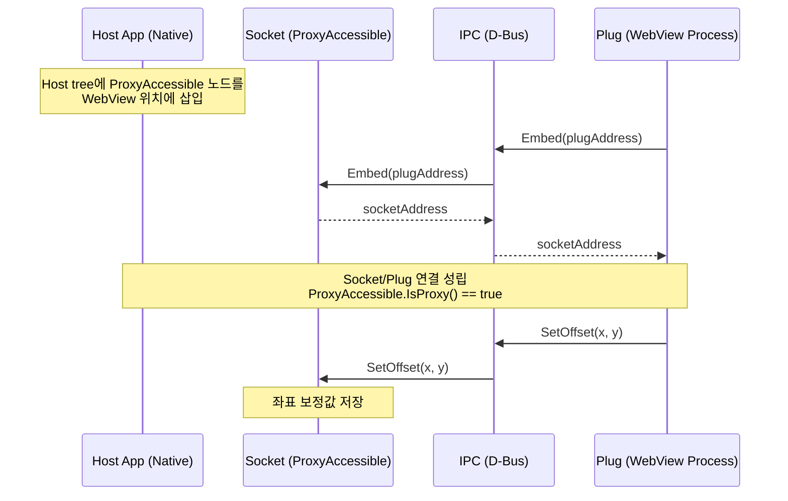
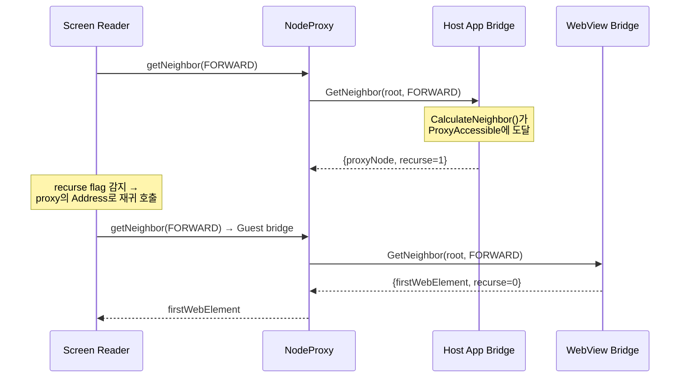
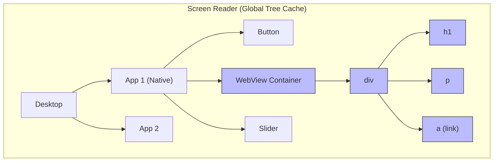
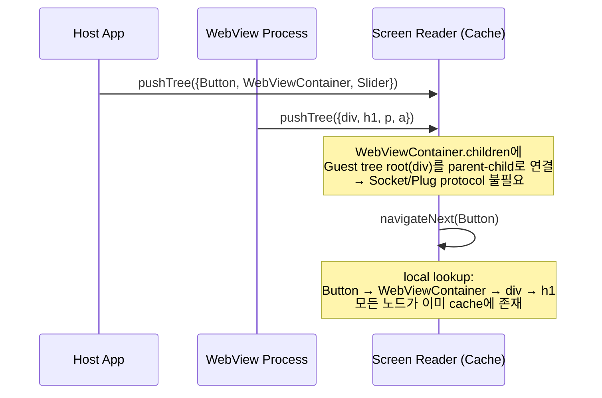
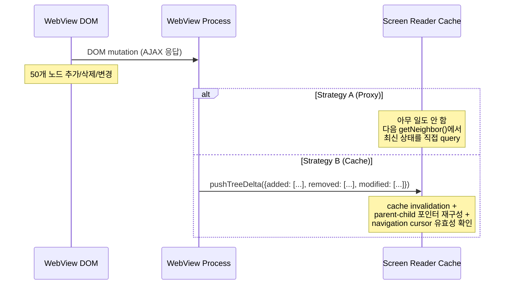

# Tree Embedding: Proxy vs Cache 분석

> Parent document: [architecture-overview.md](architecture-overview.md) — Phase 3, Architecture: Proxy vs Cache

Tree embedding은 한 프로세스의 accessibility tree가 다른 프로세스의 tree에 자식으로 삽입되는 시나리오이다. 대표적인 예가 WebView: 네이티브 앱(host) 안에 웹 콘텐츠(guest)가 렌더링되고, 스크린 리더는 두 tree를 하나의 연속된 tree로 탐색해야 한다.

---

## Strategy A (Proxy): Socket/Plug 기반 Embedding

Proxy 모델에서 tree embedding은 AT-SPI의 Socket/Plug protocol을 사용한다.



스크린 리더가 navigation 중 `ProxyAccessible`에 도달하면:



핵심 메커니즘:
- **`ProxyAccessible`**: `IsProxy() == true`인 빈 노드로, 다른 bridge의 `Address`를 보유
- **`recurse` flag**: `GetNeighbor()`와 `GetNavigableAtPoint()` 반환값에 포함. 스크린 리더가 이 flag를 보면 반환된 주소의 bridge로 동일한 호출을 재귀
- **`SetOffset(x, y)`**: 좌표계 변환. WebView의 DOM 좌표를 host 앱의 스크린 좌표로 보정
- **`Unembed()`**: WebView가 제거될 때 연결 해제

---

## Strategy B (Cache): 데이터 관계 기반 Embedding

Cache 모델에서는 embedding이 극적으로 단순해진다.





**Socket/Plug 자체가 불필요한 이유**: 스크린 리더가 모든 앱의 전체 tree를 이미 보유하므로, embedding은 단순히 cache 내에서 parent-child 포인터를 설정하는 것으로 충족된다. `ProxyAccessible`, `recurse` flag, `Embed()`/`Unembed()` 호출, `SetOffset()` 좌표 보정 — 이 모든 메커니즘이 사라진다. Navigation은 프로세스 경계를 의식할 필요 없이 단일 tree의 depth-first traversal이 된다.

---

## 비교 분석

| Aspect | Proxy + Socket/Plug (A) | Cache + 데이터 관계 (B) |
|--------|------------------------|----------------------|
| Embedding protocol | `Embed`/`Unembed`/`SetOffset` IPC 필요 | parent-child 포인터만 설정 |
| 구현 복잡도 (embedding) | `ProxyAccessible`, `recurse` flag, 재귀 호출 로직 | 단순 tree merge |
| Navigation 코드 | `IsProxy()` 분기, 2-hop IPC | 분기 없는 단일 tree traversal |
| 좌표 보정 | `SetOffset()` per embedding | cache에서 offset 연산 (local) |
| Process boundary 인식 | 스크린 리더가 반드시 인식 | 투명 (transparent) |

---

## Strategy B의 진짜 장점: Embedding 단순화

솔직히 인정해야 할 부분이 있다. Tree embedding이라는 특정 시나리오에서 Strategy B는 구조적으로 우월하다.

**Protocol 자체가 제거된다.** Strategy A에서 embedding을 위해 필요한 코드는 상당하다:
- `Socket` interface (`Embed`, `Unembed`, `SetOffset` — 3개의 IPC method)
- `Ipc::SocketClient` abstraction + `DbusSocketClient` backend
- `ProxyAccessible` class (180줄의 빈 override)
- `BridgeAccessible::GetNeighbor()`의 `recurse` flag 처리
- `BridgeAccessible::GetNavigableAtPoint()`의 `recurse` + `deputy` 처리
- 스크린 리더 쪽의 재귀 호출 로직

Strategy B에서 이 모든 것은 cache 내에서 `node.parent = hostContainer`와 `hostContainer.children.push_back(guestRoot)` 한 쌍으로 대체된다.

**Navigation이 근본적으로 단순해진다.** Strategy A에서 cross-process navigation은 항상 2-hop이다 (host bridge → `recurse` → guest bridge). Strategy B에서는 1-hop도 아닌 0-hop이다 — 모든 노드가 이미 local memory에 있다.

---

## Strategy B의 비용: Embedding 관점에서도 무시할 수 없다

그러나 embedding이 단순해지는 대가는 크다. 특히 WebView처럼 **동적으로 변하는 embedded tree**에서 비용이 집중된다.

**1. 초기 동기화 비용**

```
WebView DOM tree: 수백~수천 노드
네이티브 앱 tree: 수십 노드

Strategy A: WebView process가 자체 bridge 운영 → 스크린 리더가 필요한 노드만 on-demand query
Strategy B: WebView가 전체 DOM accessibility tree를 스크린 리더에 push해야 함
```

일반적인 웹 페이지의 accessibility tree는 수백~수천 개 노드이다. 사용자가 실제로 접근하는 노드는 화면에 보이는 수십 개뿐인데, Strategy B는 전체를 push해야 한다.

**2. DOM 변경 시 Invalidation**



SPA(Single Page Application)에서 DOM은 끊임없이 변한다. Strategy A에서는 변경 사항이 무비용(zero-cost)이다 — query 시점에 항상 최신 상태를 반환한다. Strategy B에서는 모든 DOM mutation이 IPC push + cache update + consistency check를 trigger한다.

**3. Stale 데이터 문제**

Embedding에서 가장 위험한 시나리오는 **stale navigation**이다:

```
1. Cache에 WebView tree가 동기화됨 (노드 A → B → C)
2. 사용자가 link를 클릭 → DOM이 완전히 바뀜 (노드 X → Y → Z)
3. Cache update가 아직 도착하지 않은 상태에서
4. 스크린 리더가 navigateNext() → 이미 존재하지 않는 노드 B를 반환
```

Strategy A에서는 이 문제가 원천적으로 불가능하다. `GetNeighbor()`가 호출되는 시점에 WebView bridge가 현재 DOM을 직접 탐색하기 때문이다.

**4. 복수 Embedding의 확장 비용**

WebView 하나가 아니라 여러 개의 embedded content (WebView + PDF viewer + embedded app)가 있는 경우:

| Metric | Proxy (A) | Cache (B) |
|--------|-----------|-----------|
| 메모리 (3개 embedded, 각 500 노드) | O(1) — proxy 노드 3개 | O(1500) — 전체 tree 복사 |
| Embedding 설정 | `Embed()` x 3 | `pushTree()` x 3 |
| 동적 변경 시 | 영향 없음 | 3개 tree의 sync + invalidation |

---

## 결론: Strategy A + Socket/Plug이 올바른 기본값

Tree embedding 시나리오만 놓고 보면 Strategy B의 단순함은 매력적이다. Socket/Plug protocol이라는 상당한 복잡도를 완전히 제거하고, navigation 코드에서 process boundary 분기를 없앨 수 있다.

그러나 그 단순함의 전제 조건은 **"모든 앱의 전체 tree를 항상 최신 상태로 cache에 유지"**이며, 이것이 WebView처럼 DOM이 동적으로 변하는 embedded content에서는 오히려 더 큰 복잡도를 만든다:

- **Push overhead**: 전체 tree를 push하는 비용이 Socket/Plug 설정 비용보다 큼
- **Invalidation complexity**: DOM mutation마다 cache sync가 필요하며, 이는 Socket/Plug protocol보다 복잡
- **Staleness risk**: Embedding된 tree의 stale 데이터는 navigation 오류를 직접 유발

Strategy A의 Socket/Plug protocol은 복잡하지만, 그 복잡도는 **embedding 설정 시점에 한정**된다 (`Embed`/`Unembed`/`SetOffset`). 일단 설정되면 runtime 비용은 `recurse` flag 확인 + 1회 추가 IPC뿐이다. 반면 Strategy B의 비용은 **embedded content가 존재하는 한 계속 발생**한다 (sync, invalidation, memory).

```
Strategy A 비용 분포: [설정 시 높음] → [runtime 낮음 (per-query IPC)]
Strategy B 비용 분포: [설정 시 낮음] → [runtime 높음 (continuous sync)]
```

따라서 **Strategy A (Proxy + Socket/Plug)를 기본값으로 유지**하되, Strategy B의 embedding 단순화는 향후 "정적이고 작은 embedded tree" (예: 고정된 about 페이지) 같은 특수 케이스에서 selective cache로 제한적으로 도입할 수 있는 최적화 옵션으로 남겨둔다.
